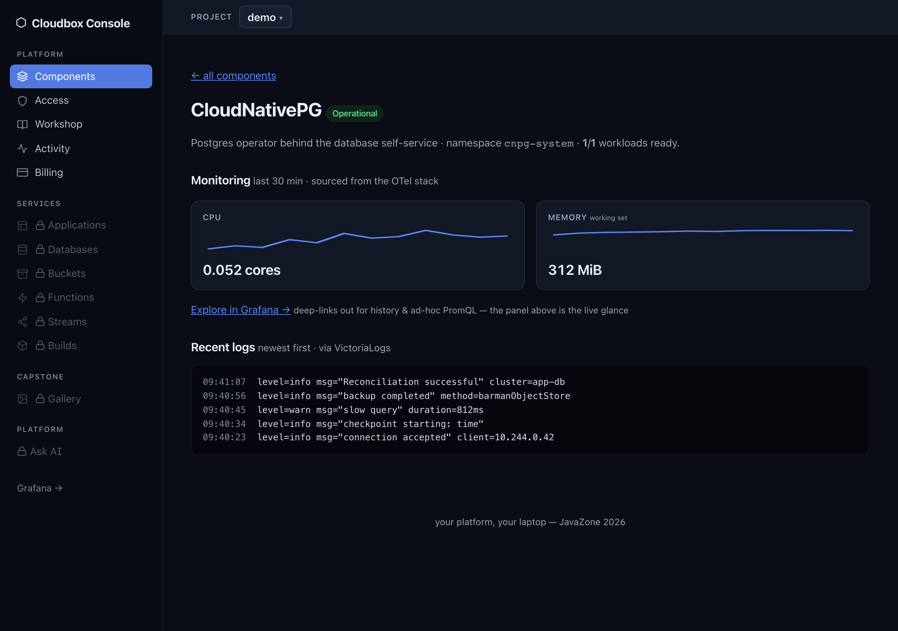
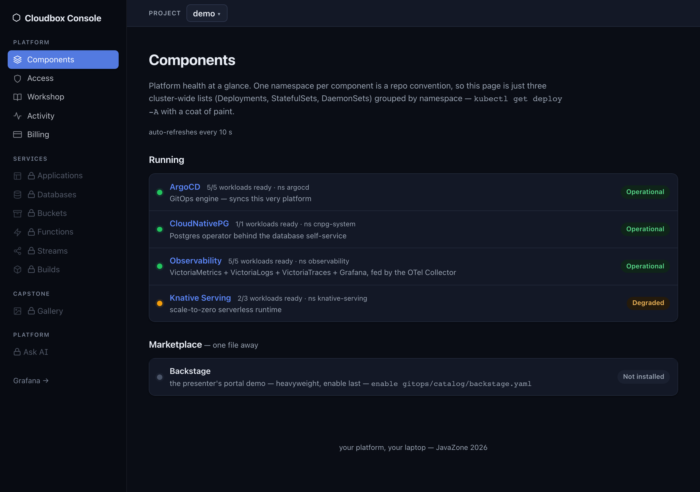

# Cloud on Your Terms: Building Your Own Cloud-Native Platform

What happens when you can no longer trust your cloud provider's pricing, jurisdiction, or
roadmap? You build your own. This is the workshop repo for JavaZone 2026: four hands-on
hours, a complete cloud-native platform on your own laptop, all open source, all pinned,
and still running after you leave the room. Labs, solutions and scripts are public, so you
can finish at home.

## What we're building

A two-node Talos Linux cluster on your laptop, with a git server and a GitOps engine
running *inside* it. Everything else arrives the same way: capabilities live as ArgoCD
`Application` manifests in `gitops/catalog/`, and you turn one on by copying it into
`gitops/apps/`, committing, and pushing to your own in-cluster Gitea. Edit, push,
converge, all day, never touching GitHub or the conference WiFi.

Kubernetes, GitOps, a managed database, S3-compatible storage, a self-service
infrastructure API, serverless, in-cluster CI, observability and a portal, delivered by
the end of the day. The full component list and why each one beat its alternative are in
**[docs/STACK.md](docs/STACK.md)**.

## Before the conference

Conference WiFi carries keystrokes, not gigabytes: setup pulls roughly 7.5 GB of images
(7.7 GB on x86-64), plus a 1.4 GB local AI model for module 10 if Ollama is installed,
so run it at home. You need Docker (Desktop, OrbStack or docker-ce)
with at least 10 GB memory, 4 CPUs and a 50 GB disk limit, unless you use tbx, which
needs none. On Apple Silicon,
decide about tbx *before* `mise run init`: it warms images for the substrate you have at that
moment, and installing the helper afterwards downloads them twice
([docs/SUBSTRATES.md](docs/SUBSTRATES.md)).

```bash
git clone https://github.com/randax/Platform-Engineering-Workshop.git
# (will be renamed to jz-2026-platform-engineering — the old URL will redirect)
cd Platform-Engineering-Workshop

./scripts/dev-setup.sh   # 1. pinned CLI tools, via mise. Say yes to the shell hook: it
                         #    points KUBECONFIG at ~/.kube/cloudbox.conf, this workshop's
                         #    cluster and nothing else
mise run init            # 2. pre-pull all pinned images (~7.5 GB, be patient)
mise run preflight       # 3. prints ✅/❌ for everything
```

**All green means you are done.** Otherwise the output names the fix, and the
[devcontainer lifeboat](.devcontainer/README.md) covers what cannot be fixed.
Broken prereqs are our bug, not yours: open an issue and we will fix it before the day.
Bring your power supply. You do not build the cluster here; that happens in the room
([Get started](#get-started)).

Steps 2 and 3 are mise tasks, like every command below (`mise tasks` lists them all, and
the scripts they run live in `scripts/`). Step 1 stays a script because it is what
installs mise. Details on the kubeconfig pin are in
[docs/SUBSTRATES.md](docs/SUBSTRATES.md#your-kubeconfig).

## Get started

We run this together at the venue; it also works at home, offline, once the images are
pre-pulled and the Helm charts are vendored, and they are, in `scripts/manifests/`
(a registry mirror the nodes pull through, [detail](docs/SUBSTRATES.md#the-offline-story)).

The cluster runs on one of two substrates, real Talos VMs via tbx or Talos-in-Docker; the
scripts detect which your machine supports and record the answer in `~/.cloudbox/substrate`,
so every later script agrees. To pin the choice for this machine instead:

```bash
mise set --file mise.local.toml CLOUDBOX_SUBSTRATE=docker    # or tbx
```

Comparison table, tbx helper install, record semantics: [docs/SUBSTRATES.md](docs/SUBSTRATES.md).

```bash
mise run cluster:create     # Talos cluster (tbx VMs or Docker) + Cilium
mise run gitops:bootstrap   # in-cluster Gitea + ArgoCD
mise run gitops:seed        # seed your cloud's git with the platform tree
```

On the Docker substrate, `mise run cluster:create` asks for your password once, at the very
end: the workshop's only sudo, writing hostnames into `/etc/hosts`
([why, and what if you decline](docs/SUBSTRATES.md#hostnames-on-the-docker-substrate)).

That is a working platform; the [labs](#lab-overview) take it from here. Fell behind or
broke something interesting? `mise run catch-up <module>` force-pushes that module's
canonical state to your Gitea and lets ArgoCD converge. If neither substrate cooperates,
`mise run cluster:fallback` builds a [kind lifeboat](docs/SUBSTRATES.md#the-kind-lifeboat) meeting the same
contract. Everything below is reference.

## Lab overview

Labs live in `lab/`. Each module states an **outcome** ("make your cluster reach state X"),
ships a `verify.sh` that checks it against the live cluster, and layers hints from gentle
nudge to full solution. You choose how much to open.

| Module | Topic | Type | Visible win |
|---|---|---|---|
| [00-setup](lab/00-setup) | Preflight & environment | core | `install.sh --check` all green |
| [01-cluster](lab/01-cluster) | Talos + Cilium: you now own a cloud | core | nodes `Ready`, Cilium green |
| [02-gitops](lab/02-gitops) | Gitea + ArgoCD, bootstrap the platform tree | core | edit → push → watch ArgoCD converge |
| [03-data](lab/03-data) | CloudNativePG + RustFS via GitOps | core | `psql` into your own DBaaS; presigned URL works |
| [04-self-service](lab/04-self-service) | Crossplane v2 compositions | core | one YAML → whole app stack appears |
| [05-debug-with-ai](lab/05-debug-with-ai) | Fault injection + AI-assisted diagnosis | core | found and fixed the seeded fault |
| [06-serverless](lab/06-serverless) | Knative Serving + Kourier | core | curl a scale-from-zero URL |
| [07-ci](lab/07-ci) | Argo Workflows + BuildKit + Zot | stretch | in-cluster image build goes green |
| [08-portal](lab/08-portal) | Cloudbox Console: a portal you can read (+ Backstage demo) | stretch | create a database from a form, prove it with kubectl |
| [09-capstone](lab/09-capstone) | Capstone: event-driven picture pipeline (Knative Eventing) | core | upload a photo → watch a resizer scale from zero → thumbnail + trace |
| [10-day2-ops](lab/10-day2-ops) | Day-2 operations: roll back a bad release | stretch | `git revert` as the durable fix, with kagent optionally assisting the diagnosis |

Core modules are the plan. Stretch modules are for the fast 20%, and for your couch
afterwards. Canonical end-states live in `solutions/`.

## The Cloudbox Console

The platform's front door: a bespoke Go + htmx portal, server-rendered, fully offline, and
small enough to read over coffee (no CDN, one vendored `.js` file, no build step). It
reads the Kubernetes API with a read-only
ServiceAccount and surfaces what you built, with per-component metrics, logs and traces
from the on-cluster OTel stack. You build it in [module 08](lab/08-portal) and it comes
fully alive in the [capstone](lab/09-capstone); the source and what each app demonstrates
are in [`apps/portal/`](apps/portal/) and [apps/README.md](apps/README.md); every
screenshot is in
[docs/screenshots/](docs/screenshots/README.md).

<p align="center">
  
  
</p>

## Running it elsewhere

The cluster runs on real Talos VMs via
[talos-box](https://github.com/randax/talos-box) where the machine supports it, and on
Talos-in-Docker everywhere else. You do not
choose: the scripts detect it and `mise run preflight` prints which you will get. Which
substrate you land on, how to pin it, the platform support matrix and the tbx helper are
all in **[docs/SUBSTRATES.md](docs/SUBSTRATES.md)**.

If `mise run preflight` will not go green on your machine, do not burn workshop time on
it: this repo ships a [devcontainer](.devcontainer/devcontainer.json) with the same
content, usable in GitHub Codespaces or locally. Setup, the machine size to pick, and the
one thing that differs there (services open from the Ports tab, not by hostname) are in
[.devcontainer/README.md](.devcontainer/README.md).

Assistants are welcome in every module, and this repo asks them to coach rather than
solve (`CLAUDE.md` / `AGENTS.md`). The house rules, and why pasting cannot win, are in
[lab/README.md](lab/README.md#ai-assistants-are-welcome).

## Workshop leaders

### Øyvind Randa

Software Architect at NextGentel and Lead Organizer for GDG Bergen

### Hans Kristian Flaatten

Platform maker, dream awaker | CNCF Ambassador | Google Developer Expert | Grafana Champion
| Co-host of Plattformpodden | Platform Engineer in Norwegian Government | Open Source
Maintainer

## License

Apache License 2.0, see [LICENSE](LICENSE). Take it, fork it, run your cloud on your terms.
