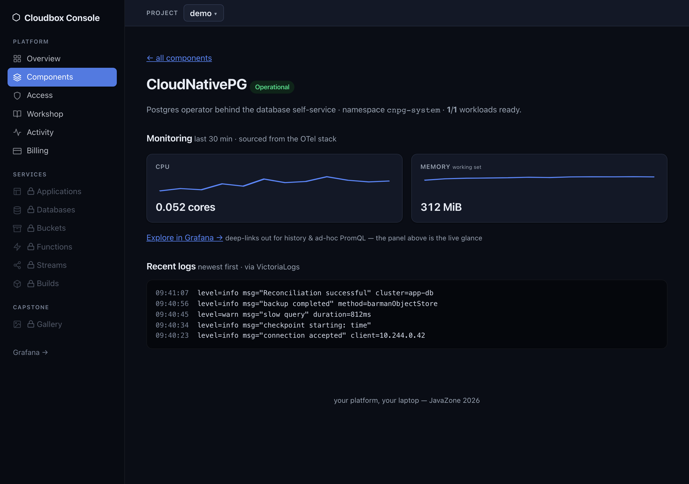
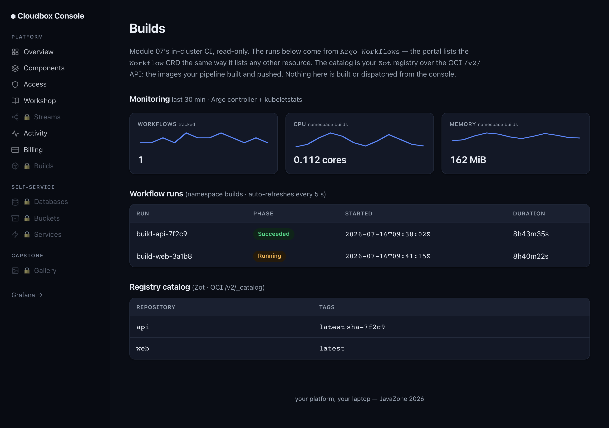
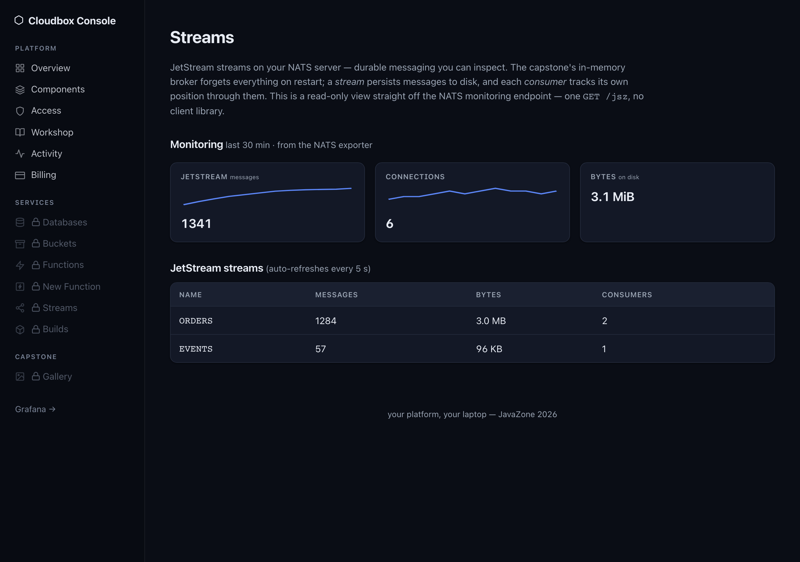
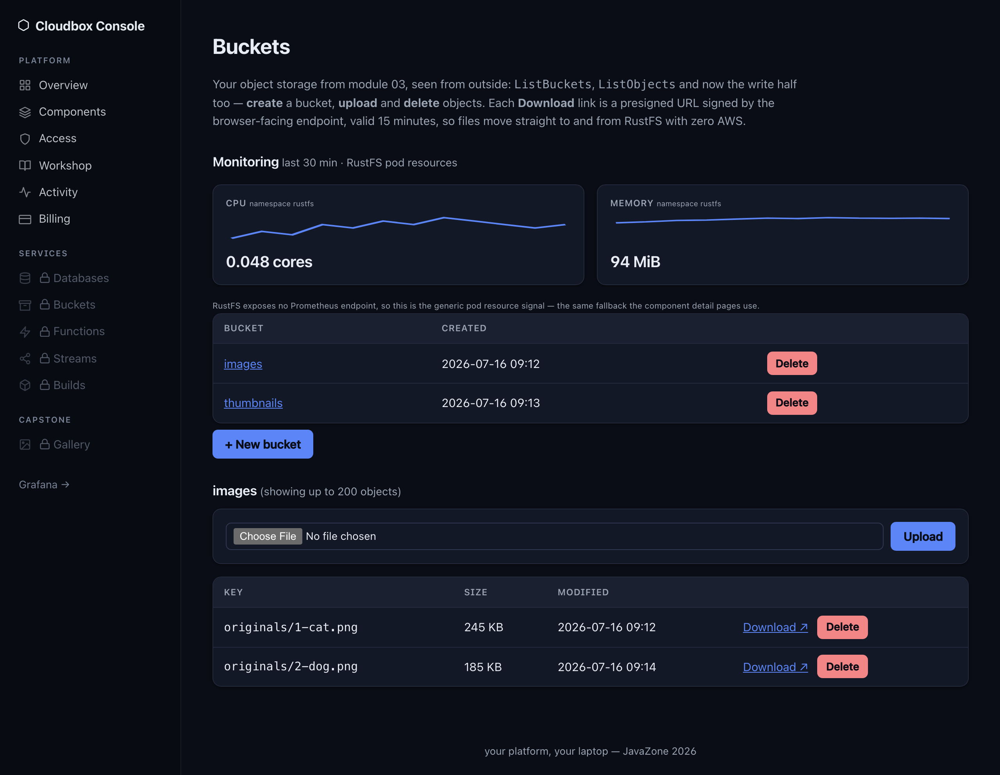
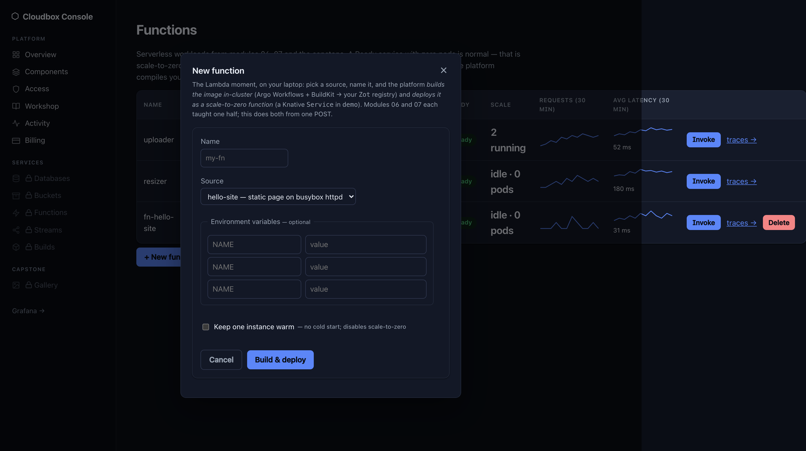

# Module 08 (stretch) — The Cloudbox Console: a portal you can actually read

## The goal

At the end of this module your platform has a front door: the **Cloudbox Console** at
http://localhost:30600, showing — live — the ArgoCD apps, Postgres clusters, and Knative
services *you built today*. The trophy: you create a database through its "New database"
form and prove with `kubectl` that a real `WorkshopDatabase` XR and a real CNPG cluster
appeared. Then you read the portal's entire source code, because it's small enough that
you can.

<p align="center">
  
</p>

<p align="center"><em>This is what you're building: the Cloudbox Console — Go + htmx, server-rendered, offline, with per-component metrics/logs/traces from your OTel stack. Light + dark themes.</em></p>

It isn't just component health, either — every capability you stood up gets its own
page with a live **Monitoring** panel fed by the same OTel stack:

<p align="center">
  
  
  
</p>

<p align="center"><em>Builds (BuildKit's resource use above the live Argo Workflows runs), Streams
(JetStream, via a prometheus-nats-exporter sidecar), and Buckets (RustFS — no Prometheus
endpoint, so the generic per-namespace pod signal). Each queries VictoriaMetrics only on
page load and degrades to "no data yet" when observability is off.</em></p>

## Why this matters

Everything you built so far is APIs and YAML — perfect for platform engineers, invisible
to everyone else. A portal is how a platform gets *adopted*: one place that answers "what
exists?" and "how do I get one?". The industry reflex is "portal = Backstage", and
sometimes that's right (we'll be honest about when, below). But a portal is not magic:
this one is ~1,300 lines of Go and htmx that read the Kubernetes API with a ServiceAccount
token. The entire source is in this repo under [`apps/portal/`](../../apps/portal/) —
after today you can read every line of your platform's front door. Try saying that about
most portals.

## The task

1. Enable `portal.yaml` from the catalog. It lands in ns `portal` and takes seconds — it's
   one small Go binary (compare that to what module 08 used to be…).
2. Open **http://localhost:30600** and explore. Six pages — Overview, Components,
   Workshop, Databases, Services, Gallery — and none of them is a mock: every row is a
   live read from your cluster (the Workshop page even tracks your module progress, live).
   For each page, answer: *which Kubernetes API is this?* (You installed all of them today.)
3. **Hand your portal the keys.** The console can *read* everything, but creating
   databases needs a write grant it deliberately doesn't ship with: grant your portal
   access to the self-service API — copy [`portal-access.yaml`](portal-access.yaml)
   (in this lab directory) to `gitops/components/demo/` in your Gitea clone and push.
   Read it first: one Role (create/get/list/delete `workshopdatabases` in ns `demo`) and
   one RoleBinding to the portal's ServiceAccount. The platform owner grants access —
   the portal can't grant itself anything.
4. **The star task.** On the Databases page, use the **New database** form: name it
   `console-db`, size `small`. Then prove it's real, the module-04 way:
   - `kubectl -n demo get workshopdatabase console-db` — the XR the form created
   - `kubectl -n demo get cluster console-db-pg -w` — the composed CNPG cluster booting

   This is *exactly* the self-service loop you built in module 04 — same XRD, same
   Composition, same controllers — with a form in front of it. The portal didn't gain any
   new powers; your platform already had the API (and you just granted the portal the
   right to use it). That's the lesson.
5. Spot the difference: your module-04 database went through git; this one didn't. Find
   the evidence (`kubectl -n demo get workshopdatabase console-db -o yaml` — who created
   it? Is it in your Gitea repo?). Keep that thought for the explain-back.
6. Run `./verify.sh`.

## How it works (read the source!)

The whole portal is eight Go files and seven HTML templates in
[`apps/portal/`](../../apps/portal/):

- **`kube.go`** — talks to the Kubernetes API from inside the pod: the ServiceAccount
  token mounted at `/var/run/secrets/kubernetes.io/serviceaccount/` is all the auth it
  has. Check what it's *allowed* to do: `kubectl describe clusterrole portal-read` —
  read-only on exactly the surfaces it renders, plus the one namespaced Role in `demo`
  for `workshopdatabases` that *you* granted in step 3. No admin token, no magic.
- **`resources.go`** — the "platform model": list ArgoCD `Applications`, CNPG `Clusters`,
  Knative `Services` as dynamic/unstructured resources.
- **`components.go`** — the Components status page: your platform's own status page,
  built from Deployment/StatefulSet/DaemonSet readiness per component.
- **`workshop.go`** — the Workshop page: live module progress inferred from cluster
  state, one simple rule per module. A hint, not a judge — each lab's `verify.sh`
  stays the authoritative check.
- **`handlers.go`** — the form POST builds a `WorkshopDatabase` object and creates it via
  the API — 20 lines that replace a whole portal product's scaffolder, because module 04
  already did the hard part.
- **`s3.go`** + the Gallery page — S3 reads against RustFS (this page comes alive in
  module 09).
- **htmx** (one vendored `.js` file, no build step) makes the forms and refreshes work.

## Build vs. buy: when you'd reach for Backstage instead

Be honest with yourself at work — bespoke won here because the platform is small and the
audience is you. Backstage earns its weight when you need:

- **The plugin ecosystem** — hundreds of integrations (ArgoCD, PagerDuty, Sonar, cost
  insights…) you'd otherwise write and *maintain* yourself.
- **A catalog at org scale** — hundreds of services, real ownership metadata,
  discoverability across dozens of teams; our console lists everything because
  everything fits on one screen.
- **TechDocs & scaffolder templates** — docs-as-code and golden-path templates with an
  ecosystem behind them.

The costs are real too: ~2 GB of Node.js + Postgres, YAML-heavy configuration, and
typically a team that owns it. A portal is a *product decision*, not a default.

> **Presenter demo (~5 min):** the presenter now enables `backstage.yaml` from the
> catalog on the projector cluster and runs the classic loop: catalog → software template
> → new Gitea repo → ArgoCD app → pods. Watch for what the template wires together —
> that integration glue is the real work of running Backstage.
>
> *Presenter notes:* pre-enable `backstage.yaml` before the module (first boot is slow,
> ~2 GB image + CNPG database — it's why this is a demo, not the lab). Show: guest
> sign-in at :30700, catalog entities fed from Gitea, run the template, then chase it
> through Gitea (:30300) and ArgoCD (:30080). `backstage.yaml` stays in the catalog —
> attendees with RAM to spare can run the same loop at home.

## Hints

<details>
<summary>Hint 1: Enabling, and what "up" looks like</summary>

In your Gitea clone:

```bash
cp gitops/catalog/portal.yaml gitops/apps/
git add . && git commit -m "enable the cloudbox console" && git push
kubectl -n portal get pods -w    # one small pod
```

It's up when `curl -s http://localhost:30600/healthz` answers `ok`. Note the portal needs
the `demo` namespace and the module-04 platform API to exist — it *is* the UI for them.
</details>

<details>
<summary>Hint 2: The form did something — where did it go?</summary>

The form POSTs to the portal, which creates a `WorkshopDatabase` in ns `demo` — from
there it's the module-04 machinery, so the module-04 commands apply:

```bash
kubectl -n demo get workshopdatabase                  # or: kubectl -n demo get wdb
kubectl -n demo describe workshopdatabase console-db  # composition events
kubectl -n demo get cluster,job,pods                  # the composed stack
```

`SYNCED True / READY False` while Postgres boots is normal; give it 2–3 minutes.
</details>

<details>
<summary>Hint 3: The portal is up but a page errors</summary>

Each page is one API call — the error names the resource it couldn't read.

1. `kubectl -n portal logs deploy/portal --tail=20` — RBAC denials and API errors land here.
2. A `workshopdatabases.platform.cloudbox.io not found` error means module 04 isn't in
   place — the portal is a *view* on the platform API; it can't invent one. A
   `... is forbidden` error means the grant from step 3 is missing: is
   `portal-access.yaml` in `gitops/components/demo/` and the `demo` app synced?
3. The Gallery page needs RustFS (module 03) and shows an empty grid until module 09
   creates the `images` bucket — empty is fine, an error is not.
</details>

<details>
<summary>Full solution</summary>

```bash
WORKSHOP="$(git rev-parse --show-toplevel)"
cd ~/cloudbox-platform   # your Gitea clone

cp gitops/catalog/portal.yaml gitops/apps/
cp "$WORKSHOP/lab/08-portal/portal-access.yaml" gitops/components/demo/
git add . && git commit -m "module 08: enable the cloudbox console + grant it demo access" && git push

kubectl -n portal rollout status deploy/portal --timeout=300s
open http://localhost:30600            # explore, then: Databases → New database
                                       # name: console-db, size: small → Create

kubectl -n demo get workshopdatabase console-db -w    # until SYNCED + READY
kubectl -n demo get cluster console-db-pg             # the real database behind the form

cd "$WORKSHOP/lab/08-portal" && ./verify.sh
```

(No UI handy? The form is sugar over the API — `kubectl apply` the same 10-line
`WorkshopDatabase` YAML from module 04 with name `console-db`, which is exactly what
`solve.sh` does.)
</details>

## Check your work

```bash
./verify.sh
```

It checks: the portal app is Synced/Healthy; the deployment is ready; the UI answers on
:30600; the `portal` ServiceAccount exists (that token is the portal's only credential);
and — once you've created it — that `console-db` is a real, Ready `WorkshopDatabase`
with a healthy CNPG cluster behind it.

## Explain-back

Tell your neighbor: your module-04 database went `git push → ArgoCD → Crossplane`; the
console's database went `form → Kubernetes API → Crossplane`, skipping git entirely.
What did you lose by skipping git? (Who can delete `console-db`, and would anything bring
it back?) When is a direct-to-API portal the right trade, and when must the form write to
git instead?

## Going deeper

<p align="center">
  
</p>

<p align="center"><em>The <strong>Functions</strong> page: the whole function lifecycle in one place — list, <strong>Invoke</strong> (wakes one from zero), <strong>Delete</strong>, and a build-and-deploy form that ties modules 06 + 07 together.</em></p>

- **Deploy a function from the console (the Lambda moment).** The **Functions** page
  (in the **Services** nav section) ties modules 06 + 07 together: in the *New function* form,
  pick a source, name it, and the console submits an Argo `Workflow` that builds your image
  (BuildKit → Zot) *and* a Knative `Service` that runs it — one form, a scale-to-zero URL,
  no CLI. The page unlocks with `knative-serving`; building also needs `argo-workflows`, and
  the two creates need one more scoped grant (same "hand the portal its keys" pattern as step 3):
  ```bash
  cp "$WORKSHOP/lab/08-portal/portal-functions-access.yaml" gitops/components/demo/
  git add . && git commit -m "grant portal: create Workflows + Knative Services" && git push
  ```
  Build `hello-site`, watch it on **Builds**, and the `fn-hello-site` row turns Ready on the
  same **Functions** page once the image lands (~1 min). Hit **Invoke** to wake it from zero
  and see the response; **Delete** removes it. Until the grant is synced the create surfaces a
  friendly *forbidden* flash — the portal can't grant itself anything.
- **Add a column.** Show each CNPG cluster's `instances` count on the Databases page
  (`resources.go` + `databases.html` — it's one field and one `<td>`).
- **Add a page.** The portal already has RBAC to list pods. A "Pods" page is ~30 lines
  by copying the Services page end to end.
- **Ship it like you mean it:** rebuild your changed portal *inside the cluster* with
  module 07's pipeline (BuildKit → Zot), point the Deployment at
  `zot.zot.svc.cluster.local:5000/...` via git, and watch ArgoCD roll it out. Your
  platform now builds and deploys its own front door.
- The take-home question: your platform has an API (module 04) *and* a portal. Which one
  is the product, and which one is the view? Argue both ways, then read
  `handlers.go` again and notice how little the portal actually does.
