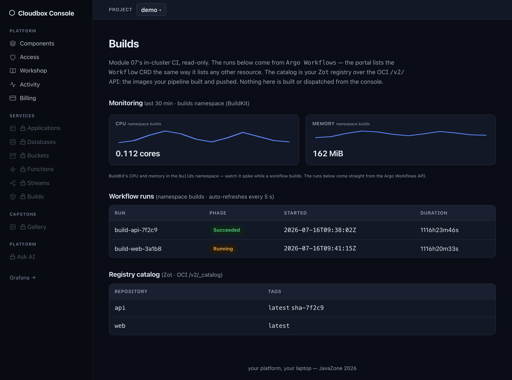
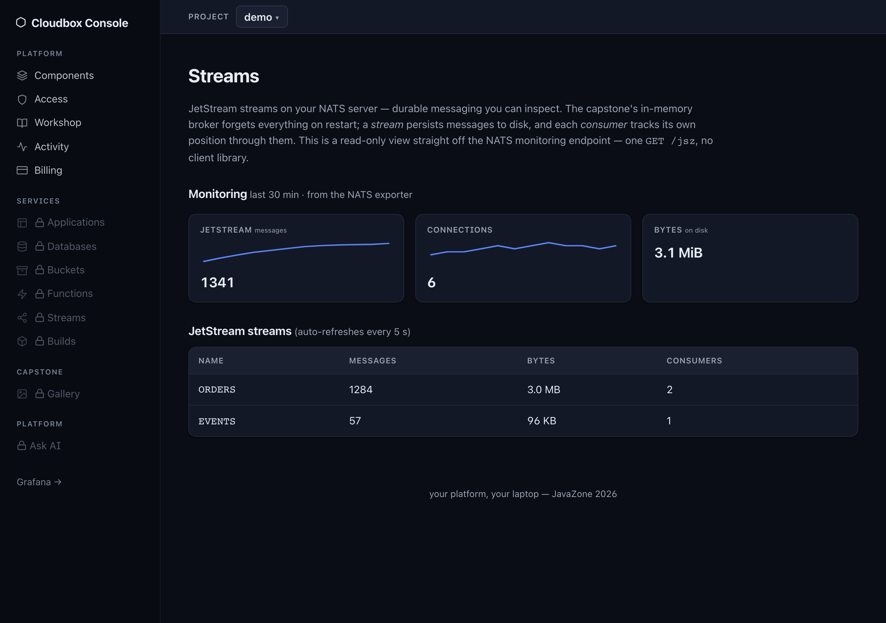
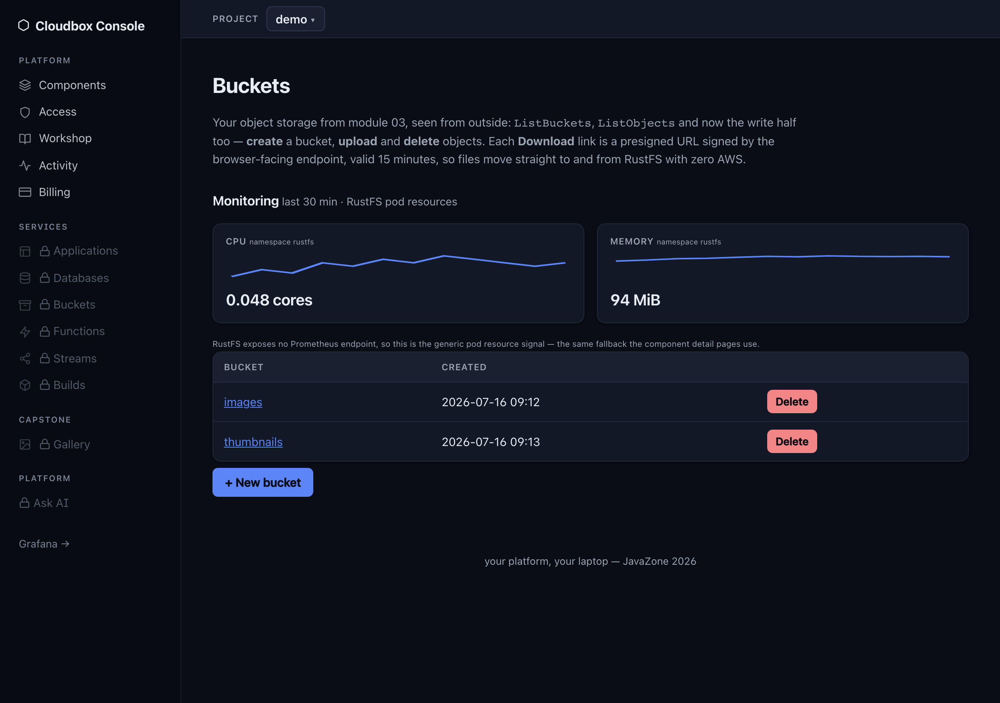
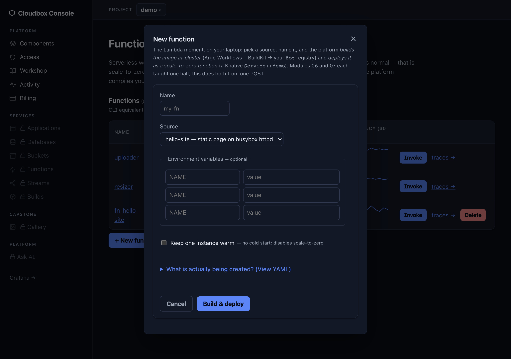

# Module 08 (stretch): the Cloudbox Console, a portal you can actually read

## The goal

The Cloudbox Console at http://portal.cloudbox.k8s.test shows live the ArgoCD apps,
Postgres clusters, and Knative services you built today. The finish line: create a
database through its "New database" form, prove with `kubectl` that a real
`WorkshopDatabase` XR and CNPG cluster appeared, then read the portal's source.

<p align="center">
  
</p>

<p align="center"><em>Go + htmx, server-rendered, offline. Light + dark themes.</em></p>

Every capability you stood up gets its own page with a live Monitoring panel fed by
your OTel stack:

<p align="center">
  
  
  
</p>

<p align="center"><em>Builds, Streams, and Buckets. Each queries VictoriaMetrics on page load
and shows "no data yet" when observability is off.</em></p>

## Why this matters

Everything you built so far is APIs and YAML, invisible to anyone who isn't a platform
engineer. A portal is how a platform gets adopted. This one is a few thousand lines of
Go and htmx in [`apps/portal/`](../../apps/portal/), no framework, no build step, and
you can read every line of it.

## The task

1. Enable `portal.yaml` from the catalog and push (the module-02 move). One small Go
   binary in ns `portal`.
2. Open http://portal.cloudbox.k8s.test and explore. Every row is a live read from
   your cluster; the Workshop page tracks your module progress. For each page, answer:
   *which Kubernetes API is this?*
3. **Hand your portal the keys.** Creating databases needs a write grant the portal
   doesn't ship with. Copy [`portal-access.yaml`](portal-access.yaml)
   (in this lab directory) to `gitops/components/demo/` in your Gitea clone and push.
   Read it first: one Role, one RoleBinding to the portal's ServiceAccount. The
   platform owner grants access; the portal can't grant itself anything.
4. **The main task.** On the Databases page, create `console-db`, size `small`. Then
   prove it's real, the module-04 way:
   - `kubectl -n demo get workshopdatabase console-db`: the XR the form created
   - `kubectl -n demo get cluster console-db-pg -w`: the composed CNPG cluster booting

   Same XRD, Composition, and controllers as module 04, with a form in front.
5. Spot the difference: your module-04 database went through git; this one didn't.
   `kubectl -n demo get workshopdatabase console-db -o yaml`: who created it? Is it in
   your Gitea repo?
6. Run `./verify.sh`.

## How it works (read the source!)

Roughly one small Go file per page plus HTML templates, all in
[`apps/portal/`](../../apps/portal/). Open first:

- `internal/kube/client.go`: the mounted ServiceAccount token is all the auth it has; `kubectl describe clusterrole portal-read` shows what that buys.
- `internal/kube/resources.go`: lists ArgoCD Applications, CNPG Clusters, Knative Services.
- `internal/web/components.go`: the platform status page, built from workload readiness.
- `internal/web/workshop.go`: module progress inferred from cluster state; each lab's `verify.sh` stays the judge.
- `internal/web/databases.go`: the New-database POST, ~20 lines that replace a portal product's scaffolder.
- `internal/store/s3.go`: Gallery reads from RustFS (comes alive in module 09).
- htmx: one vendored `.js` file, no build step.

## Check your work

```bash
./verify.sh
```

Green once the portal app is Healthy in ArgoCD, its Deployment and ServiceAccount
exist, and the console answers over HTTP. `console-db` is the star task: verify names
it when missing and fails only if it exists without becoming Ready. That lenience is
deliberate, per principle 8 in [docs/PRINCIPLES.md](../../docs/PRINCIPLES.md)
(checkpoint understanding, not completion): creating it through the form is a human
moment, and `solve.sh` still creates it so CI regression-tests the check.

## Hints

<details>
<summary>Hint 1: Enabling, and what "up" looks like</summary>

In your Gitea clone:

```bash
cp gitops/catalog/portal.yaml gitops/apps/
git add . && git commit -m "enable the cloudbox console" && git push
kubectl -n portal get pods -w    # one small pod
```

Up when `curl -s http://portal.cloudbox.k8s.test/healthz` answers `ok`. Needs the
`demo` namespace and the module-04 platform API; it *is* the UI for them.
</details>

<details>
<summary>Hint 2: The form did something. Where did it go?</summary>

The form POSTs to the portal, which creates a `WorkshopDatabase` in ns `demo`. From
there it's the module-04 machinery:

```bash
kubectl -n demo get workshopdatabase                  # or: kubectl -n demo get wdb
kubectl -n demo describe workshopdatabase console-db  # composition events
kubectl -n demo get cluster,job,pods                  # the composed stack
```

`SYNCED True / READY False` while Postgres boots is normal; give it 2-3 minutes.
</details>

<details>
<summary>Hint 3: The portal is up but a page errors</summary>

Each page is one API call, and the error names the resource it couldn't read.

1. `kubectl -n portal logs deploy/portal --tail=20`: RBAC denials land here.
2. `workshopdatabases.platform.cloudbox.io not found` means module 04 isn't in place.
   `... is forbidden` means the step-3 grant is missing: is `portal-access.yaml` in
   `gitops/components/demo/` and the `demo` app synced?
3. The Gallery page needs RustFS (module 03) and stays an empty grid until module 09.
   Empty is fine, an error is not.
</details>

<details>
<summary>Full solution</summary>

```bash
WORKSHOP="$(git rev-parse --show-toplevel)"
cd ~/cloudbox-platform   # your Gitea clone

cp gitops/catalog/portal.yaml gitops/apps/
cp "$WORKSHOP/lab/08-portal/portal-access.yaml" gitops/components/demo/
git add . && git commit -m "module 08: enable the cloudbox console + grant it demo access" && git push

kubectl -n portal rollout status deploy/portal --timeout=300s
# in your browser: http://portal.cloudbox.k8s.test
#   explore, then: Databases → New database
#   name: console-db, size: small → Create

kubectl -n demo get workshopdatabase console-db -w    # until SYNCED + READY
kubectl -n demo get cluster console-db-pg             # the real database behind the form

cd "$WORKSHOP/lab/08-portal" && ./verify.sh
```

(No UI? `kubectl apply` the module-04 `WorkshopDatabase` YAML with name `console-db`;
that is what `solve.sh` does.)
</details>

## Build vs. buy: when you'd reach for Backstage instead

Bespoke won here because the platform is small and the audience is you. Backstage
earns its costs (~2 GB of Node.js + Postgres, YAML-heavy config, a team that owns it)
when you need its plugin ecosystem, a catalog across dozens of teams, or TechDocs and
scaffolder templates. A portal is a product decision, not a default.

> **Presenter demo (~5 min):** the presenter enables `backstage.yaml` on the projector
> cluster and runs a software template: it creates a Gitea repo, ArgoCD picks it up,
> pods appear. That integration glue is the real work of running Backstage.
>
> *Presenter notes:* the CNOE image is amd64-only, so on Apple Silicon the demo
> cluster must be the Docker backend (`CLOUDBOX_SUBSTRATE=docker`); tbx VMs emulate
> nothing. Pre-enable `backstage.yaml` before the module; first boot is slow (~2 GB
> image + CNPG database). The shipped config registers no template
> (`catalog.locations` is empty): seed the template repo and register it in
> `gitops/components/backstage/backstage.yaml` first, per the comment in that file. Show guest sign-in at `http://backstage.cloudbox.k8s.test`,
> run the template, chase it through Gitea and ArgoCD. `backstage.yaml` stays in the
> catalog for home.

## Explain-back

Module 04's database arrived by git push and ArgoCD; the console's went straight to
the API, skipping git. What did you lose, and when is that the right trade?

## Going deeper

<details>
<summary>Resize a database, then catch the platform lying about it</summary>

On the database detail page, resize `console-db` from `small` to `medium`; the `patch`
verb you granted in task 3 allows it.

Three layers say it worked: the form reports success, `spec` says `medium`, and
`kubectl -n demo get cluster console-db-pg` prints `Cluster in healthy state`. All
three are wrong:

```bash
kubectl -n demo get cluster console-db-pg \
  -o custom-columns=PHASE:.status.phase,READY:.status.readyInstances,WANT:.spec.instances
kubectl -n demo describe cluster console-db-pg | tail -20
```

`medium` means 5Gi and two instances; `small` was 1Gi and one. The cluster stays at
1Gi and one instance forever. The events say why: the `local-path` StorageClass has no
`allowVolumeExpansion: true`, so Kubernetes forbids growing the PVC, and that one
failure blocks the whole Cluster reconcile. CNPG retries about every 24 seconds while
`status.phase` keeps saying healthy. The truth was in the events and the operator's
log (`kubectl -n cnpg-system logs deploy/cnpg-controller-manager | tail`).
`status.phase` is a summary, not a health check.

Resize back to `small` and CNPG refuses: `can't shrink existing storage`. It compares
against the 5Gi you asked for, not the 1Gi you have. Delete `console-db` and recreate
it `small`; modules 09 and 10 want that memory back.

Should the platform have refused the resize up front? You have the evidence to argue
it either way.
</details>

<details>
<summary>Deploy a function from the console</summary>

<p align="center">
  
</p>

In the *New function* form, pick a source and name it; the console submits an Argo
`Workflow` that builds the image with BuildKit, pushes it to Zot, and creates a
Knative `Service`. The page unlocks with `knative-serving`; building also needs
`argo-workflows` and one more scoped grant (same pattern as step 3):

```bash
cp "$WORKSHOP/lab/08-portal/portal-functions-access.yaml" gitops/components/demo/
git add . && git commit -m "grant portal: create Workflows + Knative Services" && git push
```

Build `hello-site`, watch it on Builds, and the `fn-hello-site` row turns Ready
(~1 min). Invoke wakes it from zero; Delete removes it. Until the grant syncs, the
create shows a *forbidden* flash.
</details>

<details>
<summary>Deploy the golden path, ship your own code, create projects</summary>

**The golden path from a form.** The Applications page turns the module-04
`Application` XR into a form: one POST composes a workload plus its Postgres plus its
S3 bucket. It unlocks once `application-xr` is enabled, and needs one scoped grant:

```bash
cp "$WORKSHOP/lab/08-portal/portal-applications-access.yaml" gitops/components/demo/
git add . && git commit -m "grant portal: create Applications" && git push
```

Deploy `my-app` and open its `*.kn.cloudbox.k8s.test` URL. On the Docker backend that
URL wasn't in `/etc/hosts` (no wildcards there), so teach it once:
`./scripts/install.sh --add-hosts my-app-demo`. On tbx it already resolves.

**Ship your own code (PRD-0012).** In *New Application*, switch Source to *Build from
a repo* and give an in-cluster Gitea repo. One is seeded: `cloudbox/demo-app`, a Go
service that uses its composed Postgres and bucket. Its Dockerfile builds `FROM` a
golang base in Zot, so seed that base once, from your own mirror:

```bash
crane copy --insecure localhost:5001/docker/library/golang:1.25-alpine zot.cloudbox.k8s.test/library/golang:1.25-alpine
```

On tbx the base was warmed from `public.ecr.aws`, which the `:5055` listener does not
serve; use the catch-all port instead, still offline:

```bash
MIRROR="$(tbx status cloudbox -o json | jq -r '.[0].subnet | sub("\\.0/24$"; ".1")'):5059"
crane copy --insecure "$MIRROR/public.ecr.aws/docker/library/golang:1.25-alpine" zot.cloudbox.k8s.test/library/golang:1.25-alpine
```

(Base missing from your mirror? Re-run `cloudbox-init.sh`, or pull
`public.ecr.aws/docker/library/golang:1.25-alpine` online.)

Needs both grants above; repos are restricted to the in-cluster Gitea. Change the
code, push, hit Redeploy on the detail page: it rebuilds at a fresh tag and rolls
forward. *Start from a template* creates a fresh `cloudbox/<name>` repo from the
`demo-app` template, builds, deploys.

**Projects.** The top-bar Project selector maps 1:1 to namespaces; "New project"
provisions a namespace and binds the portal's tenant grant into it. Grant via git,
act via console ([DR-0004](../../docs/prd/0004-console-write-model.md)):

```bash
cp "$WORKSHOP/lab/08-portal/portal-projects-access.yaml" gitops/components/demo/
git add . && git commit -m "grant portal: create projects (scoped)" && git push
```

Create `teama`, switch to it, provision a database, and note it lands in ns `teama`.
The console refuses hyphens in project names: a Knative URL is
`<app>-<project>.kn.cloudbox.k8s.test`, name and namespace in one DNS label, so two
name/project pairs could claim one hostname.

**Diagnostics (DR-0005).** When something isn't Ready, its detail page shows the
failing conditions, container states, and a next-step hint, the way `kubectl describe`
would. Deploy a tag that doesn't exist in Zot and watch the page name the problem.
</details>

- Add a column: each CNPG cluster's `instances` on the Databases page (`resources.go` + `databases.html`).
- Add a page: the portal already has RBAC to list pods; a Pods page is ~30 lines copied from Services.
- Take-home: your platform has an API and a portal. Which is the product, and which is the view? Read `internal/web/databases.go` again before answering.
