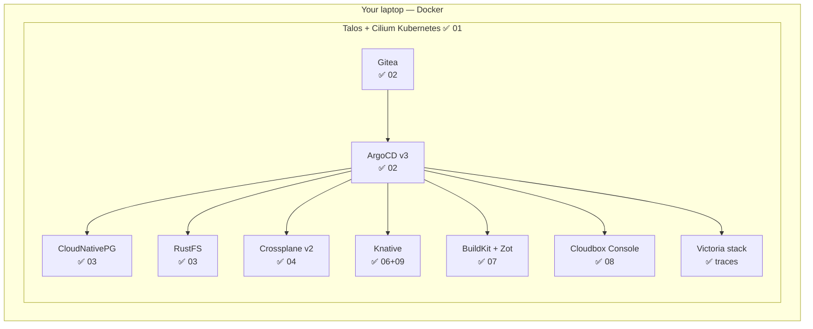

# What you built today

<!--
Closing section — bring the energy back to the front of the room for the last ten minutes (the 30 minutes of tinkering happen around it).
-->

---

# The box, now full

<!--
The same diagram from the first ten minutes — but now every box on it is running on the laptops in this room. Walk it once more, fast, in the past tense: "you built an immutable OS layer with no kube-proxy; you gave your cluster its own git server and made git the only way anything changes; you became the RDS team and the S3 team; you shipped a self-service API on Crossplane v2; you debugged it like an SRE and fact-checked an AI agent doing the same; and some of you added serverless, in-cluster CI, a portal you can read, and an event-driven pipeline traced end to end."

Then the sovereignty callback: no account was created today. No bill will arrive. Nothing phones home. When the laptop lid closes, the cloud goes to sleep — and it wakes up still yours.

The mental model is the real takeaway: cloud products are software plus an API, and every one of them has an open-source shape you can own.
-->

---

# Remember the table? All yours now.

| Cloud primitive | You're running |
|---|---|
| Kubernetes / compute | ✅ Talos + Cilium |
| Managed Postgres | ✅ CloudNativePG |
| Object storage (S3) | ✅ RustFS |
| Self-service infra | ✅ Crossplane |
| Serverless · CI · registry | ✅ Knative · Argo Workflows · Zot |
| Cloud console | ✅ Cloudbox Console |

No account. No bill. No permission.

<!--
The bookend: this is the exact comparison table from the opening "What is a cloud" section — the left column was what you'd rent from a hyperscaler. Now the right column is running on the laptop in front of you, every row green.

Say it plainly: "Four hours ago this was a shopping list of things you pay for. Now it's a list of things you own." Then hand to the sovereignty line one more time before the take-home logistics.
-->

---

# Take it home

- Everything is public, pinned, Apache-2.0
- `catch-up.sh <module>` — resume from anywhere
- Skipped the stretch? It's all still there
- `git tag javazone-2026` = today, forever
- Broken prereqs at home? Open an issue

<!--
The platform survives the room — that was the design goal, so make the path home concrete:

- The repo (github.com/randax/Platform-Engineering-Workshop) contains labs, hints, solutions, scripts, and these slides. Apache 2.0: take it, fork it, run your cloud on your terms.
- catch-up.sh <module> works on a fresh cluster at home exactly like it did here — you can rebuild to any module's end-state in minutes and continue from there. The solutions/ directory holds every canonical end-state.
- The stretch modules were designed for the couch as much as for the room: Knative, in-cluster CI, the portal source, the capstone. Nothing needs conference infrastructure.
- The javazone-2026 tag freezes today's exact versions — in a year, when everything has drifted, the tag still builds.
- And genuinely: broken prereqs or labs are OUR bug — issues welcome.
-->

---

# Going deeper

- Talos · Cilium — the metal layer
- ArgoCD · Gitea — the delivery layer
- CloudNativePG · RustFS — the data layer
- Crossplane v2 · Knative · Zot — the platform layer
- All linked from the repo README

<!--
Further-reading pointers, one line each — the repo README links all of them so nobody needs to photograph this slide:

- talos.dev and cilium.io — go deeper on the OS and eBPF layers; Talos on real hardware (or a stack of NUCs) is the natural next step after Talos-in-Docker.
- argo-cd.readthedocs.io and gitea — the app-of-apps and sync-wave patterns used today are documented ArgoCD idioms, not workshop inventions.
- cloudnative-pg.io — backups, PITR, and replicas are where the operator really starts earning its keep; rustfs.com for where RustFS goes post-1.0 (and SeaweedFS as the alternative we'd reach for).
- crossplane.io (make sure it says v2!), knative.dev, zotregistry.dev, backstage.io for the honest big-portal path, and the VictoriaMetrics stack (victoriametrics.com — VictoriaMetrics/VictoriaLogs/VictoriaTraces) fronted by Grafana and fed by the OpenTelemetry Collector for the on-demand observability layer.

Also plug the ecosystem around this audience: CNCF meetups, GDG Bergen, and Plattformpodden (Norwegian-language platform-engineering podcast Hans co-hosts) for continuing the conversation.
-->

---
layout: cover
---

# Thank you

**Your laptop. Your cloud. Your terms.**

  <strong>Øyvind Randa</strong> — Software Architect, NextGenTel · GDG Bergen 
  <strong>Hans Kristian Flaatten</strong> — Platform Engineer, Norwegian Government · CNCF Ambassador · Plattformpodden

  <code>github.com/randax/Platform-Engineering-Workshop</code> 
  ⭐ it — then go run your cloud on your terms.

<!--
Final slide — leave it up during the protected tinkering time and the goodbyes.

Thank the helpers by name; they carried the room. Thank JavaZone.

Invitations to end on:
- "The cluster on your laptop is not a demo — it's yours. Keep it. Break it. Rebuild it with catch-up."
- Find us afterwards — here, in the hallway, at the CNCF/GDG meetups, or via the repo. Both of us genuinely want to hear what you build (or what broke) when you run this at home.
- Feedback: issues and PRs on the repo are the best thank-you there is.

(If JavaZone provides a feedback QR/link for the session, put it on the projector next to this slide.)
-->
