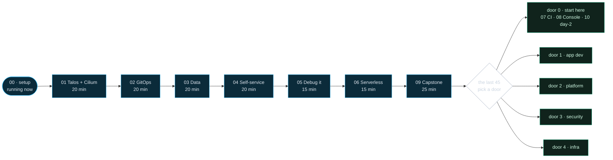

# How today works

<!--
Five minutes on mechanics, then hands on keyboards. This section is the contract for the whole day — worth getting right, then never repeating.
-->

---

# The map: one core path, then five doors

<!--
THIS TABLE IS THE DAY'S ONLY TIMELINE — every other slide's timebox is derived from it, so if a number moves, move it here first.

The guided day is 135 minutes: modules 01–05 at the tempo above (95), then serverless (06) and the capstone (09) — because a platform without scale-to-zero and without something running on top of it isn't finished, and those two are what make the day add up. Module 00 runs underneath the intro rather than in a slot of its own, and there is one 10-minute break, after module 03; from the pivot on the room is self-paced, so coffee is whenever you want it.

That leaves the last 45 for a choice of five doors. Door 0 is the one to recommend out loud — the marked trail: in-cluster CI (07), the Console's source (08) and day-2 AI ops (10), rehearsed, hinted, verified, and written to finish at home.

Expectations management, said out loud: "We planned half of what fits. If you only finish the core, you've built a real platform. The doors are for the final block — and for your couch afterwards; nothing depends on them and everything is public."

Every timebox here is a soft target — we walk the solution when the timer ends regardless, and catch-up.sh absorbs the rest. The door block is deliberately the day's buffer: it grows if we run fast and shrinks if we don't. The close never moves — hard stop 10 minutes before the end, and we finish together.
-->

---

# The lab contract

  

Outcome, not steps

the README says <em>reach state X</em>

  

Layered hints

free, collapsible, the last one is the answer

  

<code>./verify.sh</code>

checks your live cluster, green is done

  

<code>mise run catch-up &lt;n&gt;</code>

jump to any module's end-state

Live progress for the whole room, read from your cluster, on the projector all day:
<code>portal.cloudbox.k8s.test/workshop</code>

<!--
This is how every single module works, so learn it once:

1. Each lab README says "make your cluster reach state X" and roughly where to look. It deliberately does NOT hand you 12 commands to paste — pasting teaches nothing.
2. Hints escalate from a guiding question to the exact command, in collapsed blocks. Open as many as you need; nobody is counting and there's no penalty. The last hint is always the full solution — using it is fine, understanding it is required.
3. verify.sh is the finish line: it runs many small checks against your RUNNING cluster (never against your files), prints a green check per pass and an actionable FAIL per miss, exits 0 when the outcome is true.
4. catch-up.sh N force-pushes the canonical end-state for module N to your in-cluster Gitea and lets ArgoCD converge — scripted state, not hope. Broke something interesting? That's fine, catch-up exists precisely so you can experiment fearlessly. Say the destigmatizing line out loud and mean it: "catch-up is not failure — it's how the workshop is designed to absorb variance."

Also mention explain-backs: at each module boundary, two minutes, tell your neighbor WHY it works. A fix you can't explain isn't done yet.

THE LAB-LAUNCH RITUAL (same every module — presenter discipline, researched not vibes):
- The GO slide STAYS PROJECTED for the entire lab. It carries the outcome, the literal first command, the verify command, and the timebox — a room of 40 self-paced people re-orients from it constantly. Never advance past it to "peek at the next section" while people work.
- Before releasing the room, say the first two minutes aloud — the literal first command to type. Lab-start confusion is almost always "what's my first action?", not "what's the goal?".
- Run a countdown timer next to the deck (external — stagetimer.io or similar) that changes color near the end, and ALSO call "two minutes" verbally: a silent timer fails silently.
- State every timebox as a soft target: "we walk the solution at :35 regardless" — slower attendees relax because catch-up exists, and the walk-through is announced, not sprung.
- One call-back signal, announced now, used identically all day (we use: timer hits zero + both speakers stand front-center). Never try to talk over 40 keyboards.

PROGRESS PAGE (was its own slide): the Cloudbox Console's Workshop page shows one row per module, inferred from live cluster state rather than self-reporting. It is on the projector all day, and it becomes yours once the Console lands in module 08.
-->

---

# Stuck? Two of us, and whatever else helps

  

    
 Ask the room

    
<b>Green sticky</b> means fine, <b>red sticky</b> means come by. A sticky does not block you; a raised hand does.

    
One of us walks the floor, so a red is picked up on the next pass. While you wait: the next hint layer, or the neighbour who is already green.

    
Ask a question twice and it goes on the wall, answered to everyone. Pairing on one machine is encouraged, and often better.

  

  

    
 Bring your agent

    
Claude Code, Copilot, kubectl-ai, all welcome. The labs state outcomes, so pasting cannot win anyway.

    
<b>Tutor, not chauffeur.</b> The repo asks your agent to coach rather than solve. Tooling broken? Point it there, yak-shaving is not the lesson.

    
Finish line is a green <code>verify.sh</code> and being able to explain it. Module 05 drills checking what an agent claims.

  

<!--
Say the staffing plainly: it's the two of us, no helper crew. The sticky protocol survives because it batches well — a raised hand blocks you, a sticky doesn't. Be honest about latency: during each lab one of us anchors the projector and the other walks the floor, so a red sticky gets picked up on the next pass, not in thirty seconds. While waiting: next hint layer, verify.sh output, or the neighbor who's already green.

Pairing: the whole workshop works as a pair on one machine — you'll talk through more and type less. If your pre-flight fails, pair up or use the devcontainer: the repo ships a .devcontainer that runs identical content in GitHub Codespaces (4 cores / 16 GB machine). Acknowledge the irony out loud — the lifeboat for the sovereignty workshop is Microsoft's cloud, which is exactly why it's the lifeboat and not the boat.

When the room drifts apart, we'll walk the solution on screen to re-sync. That's normal, not falling behind.

The question backlog, explained to the room: when either of us answers the same question twice, it goes on a sticky on the front wall; at each walk-the-solution the presenter triages them aloud — "three of you hit X, here's the answer for everyone". With two of us this is load-bearing, not nice-to-have: we cannot answer the same question fifteen times 1:1. Our side of the floor plan is docs/RUNBOOK.md.

AI ASSISTANTS (was its own slide): Say this clearly because attendees will otherwise hide their terminals: using an AI assistant is explicitly fine in every module. We designed for it — the labs state outcomes rather than command lists precisely because copying 12 commands, yourself or via an LLM, teaches nothing.

The goal was never "typed the commands yourself". It's a running platform PLUS your ability to explain it. Two house rules:
1. verify.sh and the explain-back are the finish line, not the last command an agent ran.
2. When an assistant tells you something about YOUR cluster, check it against the cluster before acting. Module 05 exists to make that instinct permanent — including one fault where the obvious AI answer is plausible and wrong. That's a promise, not a threat.

The tutor line, said with a smile and total honesty: the repo's CLAUDE.md/AGENTS.md asks agents to coach rather than solve — Socratic questions, next hint layer, no pasted solutions. It's advisory and they can bypass it; the point isn't enforcement, it's that a workshop your agent completes teaches your agent. One carve-out to state explicitly, because it's the opposite rule: broken environments (Docker or tbx, mise, half-pulled images) are fair game for full AI firepower — nobody came here to learn yak-shaving. We apply the same split on the floor: coach on lab content, fix machines outright.
-->

