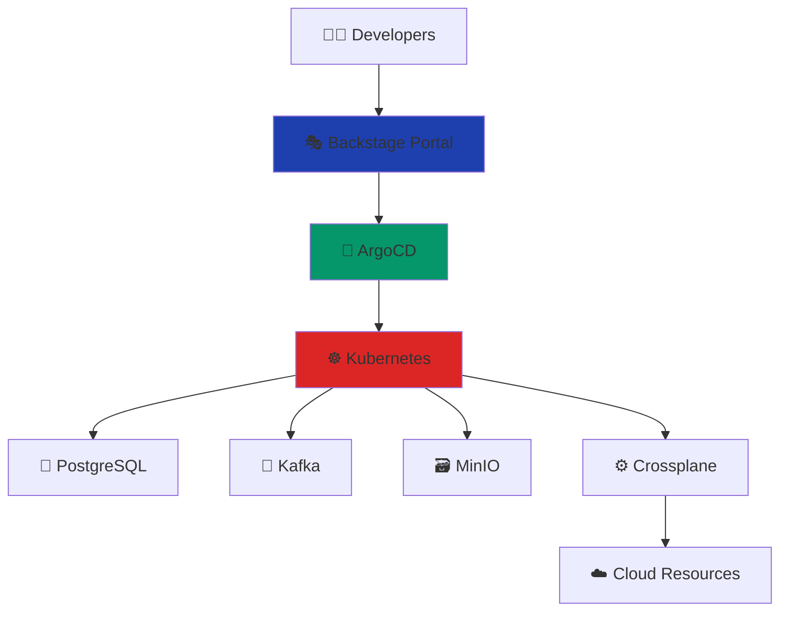

# Cloud on Your Terms
## Building Your Own Cloud-Native Platform

**JavaZone 2025 Workshop**

  
    Start Building! <carbon:arrow-right class="inline"/>
  

  

    Øyvind Randa • Hans Kristian Flaatten
  

---
layout: intro
---

# Welcome Platform Engineers! 👋

In the next 4 hours, we'll build a complete cloud-native platform from scratch. 
No vendor lock-in. No surprises. Just pure CNCF power.

  

    
🏗️

    
Platform Engineering

  

  

    
🐘

    
Database-as-a-Service

  

  

    
📨

    
Event Streaming

  

  
Prerequisites ✅

  
Modern laptop • Docker • Enthusiasm

<!--
Welcome everyone to the workshop! Set expectations:
- 4 hours intensive hands-on
- Build real platform components
- No PowerPoint theory - we code

Check if everyone has prerequisites ready:
- Docker running
- kubectl available
- Terminal access
-->

---

# The Challenge We're Solving

<v-clicks>

- **Developers** want to focus on business logic, not infrastructure
- **Operations** teams are overwhelmed with manual tasks
- **Companies** need faster delivery without compromising reliability
- **Traditional approaches** create silos and bottlenecks

</v-clicks>

  
💡 Solution

  

    Build your own cloud-native platform using battle-tested CNCF tools
  

<!--
The modern challenge is balancing developer velocity with operational excellence.
Teams are caught between:
- Speed vs Safety
- Autonomy vs Control
- Innovation vs Stability

Platform Engineering provides the answer by creating a foundation that enables both.
-->

---
layout: two-cols
---

# Our Technology Stack

<v-clicks>

**Foundation**
- 🏗️ **Kubernetes (Talos)** - Immutable OS, API-driven
- 🌐 **Cilium** - eBPF networking and security

**Data Platform**
- 🐘 **CloudNativePG** - PostgreSQL operator
- 📨 **Strimzi** - Apache Kafka on Kubernetes
- 🗃️ **MinIO** - S3-compatible object storage

**Platform Services**
- 🚀 **ArgoCD** - GitOps delivery
- ⚙️ **Crossplane** - Infrastructure as Code
- 🎭 **Backstage** - Developer portal

</v-clicks>

::right::

<!--
This is our complete technology stack:

Foundation Layer:
- Talos Linux gives us an immutable, secure, API-driven Kubernetes platform
- Cilium provides advanced networking with eBPF

Data Layer:
- CloudNativePG for managed PostgreSQL
- Strimzi for Apache Kafka event streaming
- MinIO for object storage needs

Platform Layer:
- ArgoCD for GitOps-based deployments
- Crossplane for infrastructure provisioning
- Backstage as the developer portal

Each tool is battle-tested, production-ready, and follows cloud-native principles.
-->