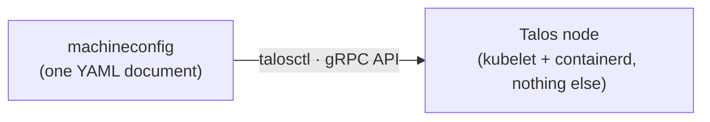

<span class="badge">Module 01 · 35 min · core</span>

# Your own cloud: Talos + Cilium

<!--
The first real module, and the biggest identity shift of the day: every cloud provider runs an operating system under your Kubernetes that you never get to see. For the next 35 minutes, attendees take ownership of that layer.
-->

---

# An OS with nothing to hack on

- Talos Linux: immutable, API-only, Kubernetes-only
- No shell. No SSH. No package manager
- One config document, managed over gRPC
- Cilium replaces CNI **and** kube-proxy with eBPF



<!--
Talos in one breath: an operating system built solely to run Kubernetes. There is no shell to SSH into, no package manager to drift, no /etc to hand-edit. The ENTIRE machine is one declarative config document — the machineconfig — and the only way to manage the node is talosctl talking to a gRPC API. The OS is managed exactly like a Kubernetes resource: declare, apply, reconcile.

Why this matters: the attack surface and the snowflake surface both collapse. This is what production-grade looks like in 2026 — and it runs happily as Docker containers on a laptop.

Cilium: does the pod networking in eBPF programs in the kernel, and also REPLACES kube-proxy entirely. In the lab they'll verify there is no kube-proxy pod anywhere — and figure out who answers Service traffic instead (eBPF programs attached in-kernel).

The lab is deliberately investigative: create the cluster with one script, then prove to yourself what you built — show a machineconfig without logging in anywhere, open the Talos dashboard, ask Talos (not Kubernetes) who its members are, show Cilium healthy and kube-proxy absent.
-->

---

# GO — Module 01

**Outcome:** 2-node cluster `cloudbox`, no SSH, no kube-proxy.

```bash
./scripts/create-cluster.sh          # ~3–5 min; read it while it runs
cd lab/01-cluster && ./verify.sh
```

<span class="badge">35 min</span> · fallback: `./scripts/kind-fallback.sh`

<!--
The script takes 3–5 minutes — the lab explicitly says to READ it while it runs. It's short on purpose: everything it does, they could type.

Then the investigation questions in the README: what is the management plane if there's no SSH? Show the machine config document. Open the Talos dashboard. Show Cilium healthy — and prove kube-proxy doesn't exist, then explain who answers Service traffic.

Explain-back at the end: "tell your neighbor what is MISSING from these nodes, and why that's a feature."

Presenter/helper notes:
- Talos v1.13 pinned (never 1.12.x — known-bad in Docker); node memory limits are raised in the script.
- If Talos-in-Docker won't cooperate on someone's machine (rare, usually exotic firewall/nftables setups on Linux), don't debug past ~10 minutes: kind-fallback.sh gives them kind+Cilium and they rejoin from module 02 with everything else identical.
- Walk the solution on screen at ~30 min to re-sync the room.
-->
