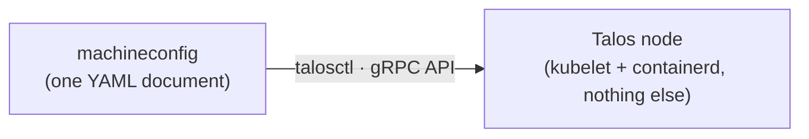

<span class="badge">Module 01 · core</span>

# Your own cloud: Talos + Cilium

<div class="modlogos"><Logo name="talos" label size="2.6rem"/> <Logo name="cilium" label size="2.6rem"/></div>

<div class="story"><span class="tag">BRUKTBY</span> &nbsp;Their new datacenter is two Talos nodes on this laptop (VMs or containers, depending on your substrate), an immutable OS with no server to SSH into and pet.</div>

<!--
The first real module, and the biggest identity shift of the day: every cloud provider runs an operating system under your Kubernetes that you never get to see. For the next half hour, attendees take ownership of that layer.
-->

---

# An OS with nothing to hack on

- Talos Linux: immutable, API-only, Kubernetes-only
- No shell. No SSH. No package manager
- One config document, managed over gRPC
- Cilium replaces CNI **and** kube-proxy with eBPF


```mermaid {scale: 0.7}
flowchart LR
  yaml["machineconfig<br>(one YAML document)"] -->|"talosctl · gRPC API"| node["Talos node<br>(kubelet + containerd, nothing else)"]
```

<div class="mt-6 text-sm opacity-75">
<span class="svgi i-cloud"></span> <strong>Cloud parallel:</strong> EKS · AKS · GKE hand you a cluster and hide this layer. Today you own the OS and the network underneath it.
</div>

<!--
Talos in one breath: an operating system built solely to run Kubernetes. There is no shell to SSH into, no package manager to drift, no /etc to hand-edit. The ENTIRE machine is one declarative config document, the machineconfig, and the only way to manage the node is talosctl talking to a gRPC API. The OS is managed exactly like a Kubernetes resource: declare, apply, reconcile.

Why this matters: the attack surface and the snowflake surface both collapse. This is what production-grade looks like in 2026, and it runs happily on a laptop: real Talos VMs via talos-box where that works (macOS/Linux), Talos-in-Docker containers everywhere else. create-cluster.sh picks; every module after this is identical on both.

Cilium: does the pod networking in eBPF programs in the kernel, and also REPLACES kube-proxy entirely. In the lab they'll verify there is no kube-proxy pod anywhere, and figure out who answers Service traffic instead (eBPF programs attached in-kernel).

The lab is deliberately investigative: create the cluster networkless, diagnose WHY it's NotReady, give it its network yourself, then prove what you built. Show a machineconfig without logging in anywhere, open the Talos dashboard, ask Talos (not Kubernetes) who its members are, show Cilium healthy and kube-proxy absent.
-->

---

# GO: Module 01

**Outcome:** 2-node cluster `cloudbox`, no SSH, no kube-proxy, and **you** installed its network.

```bash
./scripts/create-cluster.sh --skip-cilium   # a few min; read it while it runs
kubectl get nodes                           # NotReady. Your move.
# → install Cilium yourself (lab task 3), watch NotReady become Ready
cd lab/01-cluster && ./verify.sh
```

<span class="badge">20 min</span> · fallback: `./scripts/kind-fallback.sh`

<!--
The script deliberately stops HALF-DONE: --skip-cilium leaves the cluster with no CNI, nodes NotReady, coredns Pending. That's not a bug to rescue people from, that IS the lab. Say it from the front: "your cluster is exactly as alive as a cloud region with no network fabric; go find out why, then fix it." The helm install they run (hint 3 has the exact command; the script itself is the reference solution) is the same one every managed cloud hides from them. The NotReady→Ready flip in a -w watch is the moment of the module.

Attendees who fall behind: plain create-cluster.sh (no flag) still does everything. Same end state, verify.sh can't tell the difference. Catch-up and CI use that path.

Then the investigation questions in the README: what is the management plane if there's no SSH? Show the machine config document. Open the Talos dashboard. Show Cilium healthy, and prove kube-proxy doesn't exist, then explain who answers Service traffic.

Explain-back at the end: "tell your neighbor what is MISSING from these nodes, and why that's a feature."

Presenter notes:
- Talos v1.13 pinned (never 1.12.x, known-bad in Docker); node memory limits are raised in the script.
- Expect a mixed room: `cat ~/.cloudbox/substrate` says which one a machine got. The lab's "break a node" bonus is branched per substrate (`tbx node stop|start`, or `docker pause|unpause`); everything else is plain kubectl/talosctl and identical.
- If the substrate won't cooperate on someone's machine (rare), don't debug past ~10 minutes: `CLOUDBOX_SUBSTRATE=docker ./scripts/create-cluster.sh` is the first fallback, and kind-fallback.sh gives them kind+Cilium as the last one. They rejoin from module 02 with everything else identical.
- Walk the solution on screen at ~16 min to re-sync the room before the timer.
-->
