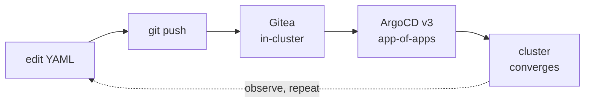

<span class="badge">Module 02 · 35 min · core</span>

# GitOps: your cluster gets a git server

<!--
The architectural heart of the workshop. Everything from here to the end of the day — databases, platform APIs, serverless, the portal — arrives as a git commit that ArgoCD converges. Frame it that strongly.
-->

---

# The loop you'll use all day



- Git is the **only** way anything changes
- Your git server runs **inside** the cluster

<!--
The loop: edit → push → Gitea → ArgoCD → cluster. Say it twice; it's the muscle memory for the rest of the day.

The design decision worth dwelling on: the git server is IN the cluster. Your platform does not depend on GitHub, on the venue WiFi, or on anyone's SaaS. That's "cloud on your terms" expressed in one architecture choice. (It also means the workshop survives conference WiFi.)

ArgoCD v3 with the app-of-apps pattern: one root Application watches a directory in the repo and creates other Applications from it, in sync waves. This is genuinely how real platform teams bootstrap clusters — not a workshop simplification.

In the lab they'll poke both UIs: Gitea at localhost:30300 (gitea_admin / cloudbox123), ArgoCD at localhost:30080 (admin, password fetched from the cluster — that's hint 1). Then the real thing: clone the platform repo FROM their own Gitea, add an Application + a ConfigMap with their own name in it, push, and watch a namespace materialize without ever running kubectl apply.
-->

---

# The catalog: enabling a capability

```bash
cp gitops/catalog/rustfs.yaml gitops/apps/
git commit -am "enable rustfs" && git push
# ...then watch ArgoCD converge
```

- `gitops/catalog/` — every capability, ready-made
- `gitops/apps/` — what your platform runs
- Copy → commit → push → converge

<!--
The second mechanic to internalize, because every module from 03 onward starts with it: platform capabilities live as a catalog of ready-made ArgoCD Application manifests in gitops/catalog/. Enabling one = copying it into gitops/apps/, committing, pushing to your own Gitea. ArgoCD notices and converges.

This is a real pattern, scaled down: the catalog is the platform team's menu; the apps directory is the cluster's order. Later, in module 08, they'll see Backstage's software templates doing a fancier version of exactly this.

No kubectl apply for platform components, all day. If someone is tempted to shortcut with kubectl: it will work, and then ArgoCD will quietly revert it — which is itself a lesson worth having on the projector.
-->

---

# GO — Module 02

**Outcome:** push a commit, watch it materialize. No `kubectl apply`.

```bash
./scripts/bootstrap-gitops.sh && ./scripts/seed-gitea.sh
cd lab/02-gitops && ./verify.sh
```

<span class="badge">35 min</span> · behind? `./scripts/catch-up.sh 2`

<!--
Two scripts install the machinery: bootstrap-gitops.sh puts Gitea and ArgoCD into the cluster; seed-gitea.sh pushes this repository into the in-cluster Gitea (the cloudbox/platform repo).

Then the lab: explore both UIs, answer the README's questions about the root Application and sync waves, and make a real change through git — the demo Application plus a welcome ConfigMap with YOUR name as owner.

The win to celebrate on the projector: someone's namespace appearing in ArgoCD's UI seconds after their push. Ask the room: "who touched kubectl apply? Nobody? That's GitOps."

Explain-back: "why is the git server inside the cluster — what breaks if we'd used GitHub instead?" (Answer: WiFi dependency, SaaS dependency, and the sovereignty story.)

From this point on catch-up.sh works for every module — it force-pushes canonical state to their Gitea. Anyone stuck at 30 min: catch up, don't stall; the concepts land in 03–04 again.
-->
