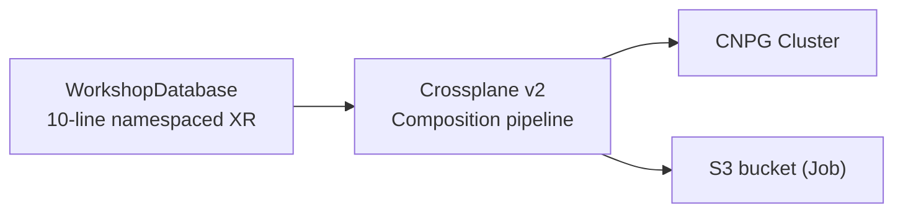

<span class="badge">Module 04 · 35 min · core</span>

# Self-service: your platform gets an API

<div class="story"><span class="tag">BRUKTBY</span> &nbsp;Their app devs get self-service back — one YAML for a database, no ticket to the platform team. The 2008 magic, self-hosted.</div>

<!--
Module 03 made the attendee capable of provisioning databases. This module builds the abstraction so their developers never have to be: platform engineering in its purest form — you define an API, developers consume it.
-->

---

# One resource in, a stack out



- You own **both** sides of the API
- `aws rds create-db-instance` — but yours

<!--
The concept: developers shouldn't need to know CNPG, storage classes, or RustFS endpoints. Platform engineering is building the abstraction — you define WHAT can be asked for (an XRD: the WorkshopDatabase schema), and HOW it's fulfilled (a Composition), and developers just write a 10-line resource.

Crossplane is the machinery: the XR (composite resource) comes in, the composition pipeline runs, and out come real resources — a CNPG Cluster AND a Job that creates the matching S3 bucket. One request, a whole wired stack.

The punchline for the room: this is exactly what `aws rds create-db-instance` is — a small request against an API someone composed into real infrastructure. The difference is that after this module, YOU own both sides of that API.

Lab flow: enable crossplane.yaml from the catalog, ship the two halves of the platform API (xrd.yaml — read the schema!, composition.yaml) via git, confirm the XRD is ESTABLISHED, then switch hats and be the developer: push examples/my-database.yaml and watch the stack unfold.
-->

---

# ⚠️ Your training data is stale

- This is Crossplane **v2** (2025)
- Claims are **gone** — namespaced XRs instead
- Compositions emit K8s resources **directly**
- See `kind: Claim` or `claimNames`? That's v1
- Your AI assistant almost certainly learned v1

<!--
A headline teaching point, and the first place today where "verify what the assistant says" gets concrete.

Crossplane v2 (GA in 2025) restructured the core model:
- Claims are GONE. In v1 you had cluster-scoped XRs plus namespaced Claims proxying them; in v2 you simply create namespaced XRs directly. Simpler — but it means nearly every blog post, tutorial, and Stack Overflow answer out there describes an API that no longer exists.
- Compositions are pipeline-mode only, and they can emit plain Kubernetes resources DIRECTLY — our composition outputs a CNPG Cluster and a Job with no provider-kubernetes wrapping. In v1 you needed a provider for that.

Field guide for the room: if you (or your AI assistant) see `kind: Claim`, `claimNames` in an XRD, or a top-level `resources:` list in a Composition — you are reading the past. The lab README carries the same warning.

This lands twice: it's a real operational skill (knowing which major version your sources describe), and it foreshadows module 05's theme — plausible, confident, out-of-date answers are exactly what agents produce when their training data lags the ecosystem.
-->

---

# GO — Module 04

**Outcome:** a 10-line YAML → database + bucket appear.

```bash
# enable crossplane.yaml; ship platform/xrd.yaml + composition.yaml
cd lab/04-self-service && ./verify.sh
```

<span class="badge">35 min</span> · behind? `./scripts/catch-up.sh 4`

<!--
The task: enable crossplane.yaml from the catalog (installs Crossplane v2, the patch-and-transform function, and the RBAC letting it manage CNPG Clusters and Jobs). Ship the platform API — the XRD and the Composition from the lab's platform/ dir — as a new component via git. Then be the developer: push the 10-line example WorkshopDatabase and watch the XR, the composed CNPG Cluster, and the bucket Job appear.

Watching the stack unfold is the win: kubectl get workshopdatabase, then the Cluster booting, then the Job completing.

Explain-back: "walk your neighbor through what happened between your 10-line YAML and the running Postgres — name each controller that acted." (ArgoCD delivered it, Crossplane composed it, CNPG realized it.)

Helper note: the classic failure is an XRD that never goes ESTABLISHED because of a schema typo — kubectl describe xrd shows why. And anyone pattern-matching from v1 tutorials will trip exactly as the warning slide predicted; that's a teachable moment, not a bug.

This module's API is load-bearing later: module 08's portal form creates exactly these WorkshopDatabase resources.
-->
