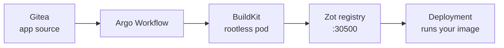

<span class="badge">Module 07 · stretch · demo + self-paced</span>

# CI on your terms: build inside the cluster

<!--
Presenter-demo-first module: rootless BuildKit on Talos is pioneer territory (nobody has published this combo), so the front of the room shows the golden path, and the lab stays available for the brave and for home.
-->

---

# Your registry, your builds



- CI is just pods with filesystem tricks
- Git → build → push → deploy: all in-cluster

<!--
The concept: CI is the last thing teams believe they can't self-host ("but we need GitHub Actions!"). Strip the branding and a build is just a pod doing elevated filesystem tricks, and a registry is a single binary.

The 2026 stack, accurately: Kaniko — the old in-cluster build answer — is archived/dead. Rootless BuildKit is its replacement. Zot is the CNCF registry, one small binary. Argo Workflows orchestrates: clone from the in-cluster Gitea, build with BuildKit, push to Zot, deploy. Every hop of git → build → push → deploy happens inside the laptop's cluster — zero external services.

One honest detail worth teaching: the builds namespace is labeled PSA-privileged, because rootless BuildKit needs an unconfined seccomp profile. Finding that label and understanding why it exists is part of the lab — security boundaries for builds are a real platform-team concern, not workshop trivia.

Honesty note from the lab README, worth repeating from the front: this is the least-rehearsed path in the workshop — rootless BuildKit on Talos has no published prior art. It's a presenter demo first, self-paced lab second. If it fights you, watch the demo, file the scars, move on.
-->

---

# GO — Module 07

**Outcome:** an image built in-cluster, in your registry, running.

```bash
# enable zot.yaml + argo-workflows.yaml; submit workflow-run.yaml
cd lab/07-ci && ./verify.sh
```

<span class="badge">demo first</span> · then self-paced, ~25 min

<!--
Presenter demo first (~5 min): enable both catalog apps on the projector cluster, submit the build workflow, follow it to Succeeded, then prove the artifact is real by querying Zot's OCI API (/v2/ endpoints on NodePort 30500) — and run the freshly built image via GitOps.

Then self-paced for those who want it: the same flow with the tiny app in lab/07-ci/app/ (a Dockerfile + one HTML page, already in everyone's Gitea because the whole repo was seeded).

The two beats to narrate during the demo:
1. The workflow's build step is just a pod — show it in kubectl get pods -n builds while it runs.
2. The registry answer: curl Zot's /v2/_catalog and there's the image. "Your registry. Your build. No Docker Hub, no GitHub Actions, no external anything."

Helper note for self-paced attempts: workflow stuck in Pending is usually the PSA label question from the README; build failures inside BuildKit are the deep end — that's what restore/`catch-up.sh 7` and the demo recording are for.
-->
