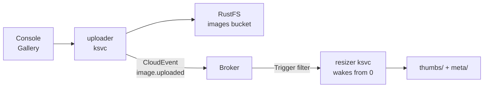

<span class="badge">Module 09 · capstone · self-paced finale</span>

# The picture pipeline: everything, wired together

<!--
The capstone. It earns the name because it uses everything built today at once: GitOps delivers it (02), RustFS stores it (03), Knative scales it from zero (06), the portal fronts it (08), and observability watches the whole chain. The one new concept is Knative Eventing.
-->

---

# One upload, five actors, zero coupling



- Uploader doesn't know the resizer exists
- It emits a **fact**; the Broker routes it

<!--
The new concept is Knative Eventing: a Broker and Triggers — the open-source shape of the S3-events → SQS → Lambda pattern everyone knows from AWS.

Walk the flow left to right: the Gallery page posts the photo to the uploader (a Knative service that itself cold-starts to receive it). The uploader writes the original to the images bucket in RustFS, then emits a CloudEvent — type dev.cloudbox.image.uploaded — to the Broker. The Broker consults its Triggers; one filters on exactly that type and subscribes the resizer. The resizer — which is NOT RUNNING — wakes from zero, fetches the original, writes a thumbnail and a metadata JSON (dimensions, dominant color), and goes back to sleep.

The architectural point on the slide: the uploader doesn't know the resizer exists. It emits a fact; the Broker routes it to whoever subscribed. Adding a second consumer (a virus scanner, an ML tagger) would be one more Trigger — no uploader change. That decoupling is the whole point of event-driven architecture, and today it runs on a laptop, readable end to end.

Demystifier worth saying: a CloudEvent is just an HTTP POST with five ce-* headers — the lab has them read those headers in the resizer's logs.
-->

---

# Prove it three ways

- **Watch:** resizer pod appears from nowhere
- **Storage:** `originals/`, `thumbs/`, `meta/*.json`
- **Trace:** the whole chain, one waterfall
- Grafana: portal → uploader → broker → resizer

<!--
The verification trilogy — and the observability payoff for the whole day:

1. The watch: kubectl -n pipeline get pods -w in one terminal, upload a photo in the Gallery in the other. The uploader cold-starts to catch the file, then — a beat later — the resizer materializes to handle an event nobody visibly sent. Ask the room to count the actors between browser and that second pod.
2. The storage view: the Gallery (refresh) shows the thumbnail and its metadata; raw S3 shows originals/, thumbs/, and meta/<key>.json in the images bucket — module 03 muscle memory with the aws CLI against :30900.
3. The flourish: find the upload's trace in Grafana (the otel-lgtm pod in ns observability) and see portal → uploader → broker → resizer as ONE waterfall. Distributed tracing across an event-driven, scale-from-zero chain — on a laptop. This is the "look at what you built" moment for observability, which has been quietly installed since module 02.

Hint 5 covers Tempo navigation for anyone new to traces; hint 2 has the hop-by-hop event-debugging path (uploader logs → trigger status → broker filter logs) if no resizer appears.
-->

---

# GO — Module 09

**Outcome:** upload a photo → a service that wasn't running resizes it.

```bash
# enable knative-eventing.yaml + picture-pipeline.yaml
cd lab/09-capstone && ./verify.sh
```

<span class="badge">~25 min</span> · trophy: the trace in Grafana

<!--
The task: enable knative-eventing.yaml (the Broker/Trigger machinery in ns knative-eventing) and picture-pipeline.yaml (ns pipeline: Broker, uploader + resizer as cluster-local ksvcs, the Trigger, and a Job creating the images bucket) — both can go in one push; Eventing's webhook takes a minute and the pipeline app retries until it's up, same dance as module 06.

Readiness check before the moment: kubectl -n pipeline get broker,trigger,ksvc all Ready — and note the pod count: with no traffic, both ksvcs sit at zero.

Then stage the two terminals, upload at localhost:30600/gallery, and work through the three proofs from the previous slide. verify.sh seals it.

Anyone finishing this has run the full arc: platform built by git commits, storage and databases self-hosted, a self-service API, a portal, and an event-driven serverless pipeline traced end to end. Send them to the closing section victorious — and remind the room the last 30 minutes are protected tinkering time.
-->
