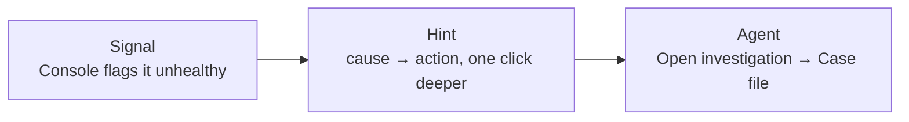

<span class="badge">Module 10 · stretch · self-paced</span>

# Day 2: the app you shipped this morning is on fire

<div class="story"><span class="tag">BRUKTBY</span> &nbsp;Their listing service — solid all morning — crashloops after a routine-looking commit at lunch. Nobody paged them; the platform did.</div>

<!--
Everything up to now has been day 1: build it, ship it, watch it come up green. Day 2 is where platforms actually earn their keep — the moment something that was working breaks, usually because someone (maybe you) pushed a change. Module 05 taught the debugging discipline with a bring-your-own AI assistant sitting outside the platform; this module puts an agent INSIDE the platform as a first-class, GitOps-delivered capability, wired straight into the Console built in module 08.

The shape of the module: three realistic faults land as plausible git commits against your own demo-app (a bad rollback, a "rightsizing" that OOMKills, an image reference that quietly points at Docker Hub). Work each one through an escalation ladder — signal, hint, agent — and fix everything with git revert, never a console apply button.

This is a stretch module: nothing later depends on it, and module 05's muscle memory is the rehearsed fallback if anything about Kagent itself misbehaves on the day.
-->

---

# The escalation ladder: signal → hint → agent



- Most incidents die at step 1 or 2 — that's the design working
- Escalate only when the hint isn't enough
- Step 3 is always one click away, never forced

<!--
The ladder is deliberate, and it's the same one built across modules — not a new invention for module 10.

Step 1, Signal: the diagnostics work (DR-0005 slice 1) gave every resource page a WHY-it's-unhealthy rollup — CrashLoopBackOff, ProgressDeadlineExceeded, whatever the controller reports, no guessing required.

Step 2, Hint: DR-0005 slice 2 turned that signal into a cause → action hint — "likely OOM, check requests/limits" — one click deeper, still fully deterministic, no LLM involved anywhere yet.

Step 3, Agent: only when the hint runs out does "Open investigation" appear on the application-detail page, and it's always available, never mandatory — most incidents resolve at step 1 or 2, and that's the ladder working as designed, not the agent failing to add value.

The pedagogical point of the whole slide: an AI agent is the LAST resort here, not the first reflex — the opposite of "day 2 starts by pasting logs into a chatbot." The Console already told you WHAT'S wrong and probably WHY; the agent earns its keep on the harder slice where those aren't enough.
-->

---

# Kagent: agents as Kubernetes resources

<div class="grid grid-cols-2 gap-4 mt-4">
  <div class="principle">
    <div class="ico"><span class="svgi i-hexagon"></span></div>
    <div class="name">An agent is a CRD</div>
    <div class="tie" style="opacity:.85"><code>kagent.dev/v1alpha2 Agent</code> — a controller reconciles it into a Deployment. Versioned in git like everything else shipped today.</div>
  </div>
  <div class="principle">
    <div class="ico"><span class="svgi i-package"></span></div>
    <div class="name">Delivered like every capability</div>
    <div class="tie" style="opacity:.85"><code>gitops/catalog/kagent.yaml</code> → <code>gitops/apps/</code> → push → ArgoCD converges. CNCF Sandbox project, pinned in <code>scripts/versions.env</code> like everything else; only <code>k8s-agent</code> enabled.</div>
  </div>
</div>

<div class="mt-5 text-lg opacity-85">One more CRD your platform reconciles — nothing new to learn to install it.</div>

<!--
The headline demystification: "an AI agent" sounds like a new category of thing to operate, but mechanically it's a CRD — same shape as the WorkshopDatabase from module 04 or the Application from module 02. kagent.dev/v1alpha2 Agent describes a system prompt and a toolset; the kagent controller reconciles it into a Deployment running the conversation loop.

And it arrives exactly the way every capability has all day: copy gitops/catalog/kagent.yaml to gitops/apps/, push to Gitea, ArgoCD syncs it. No new mental model for "how do I turn this on" — the progressive-enable mechanic from module 02 just keeps paying off.

Scoping facts worth saying out loud: kagent is a CNCF Sandbox project (accepted May 2025), pinned in scripts/versions.env at the maintained stable 0.9 line, while v0.10 is still an active beta series, and upstream's "latest release" tag misleadingly resolves to one of those betas; that trap is called out with a comment in the single version-pin file. The chart ships ten built-in agents; this module enables exactly one, k8s-agent — the Kubernetes troubleshooting agent — and disables the doc-search tool and kagent's own web UI (scaled to zero), because the Console is the only surface attendees touch.
-->

---

# The cliff: one tool call vs. a diagnosis

| Model | Single-turn | Multi-turn (BFCL v3) |
|---|---|---|
| GPT-4o-class | ~80–90% | **~41–48%** |
| Qwen3-4B (`qwen3:4b`, 2.5 GB) | ~80%+ | **~16%** |
| Llama-3.1-8B-Instruct | ~80%+ | **~5%** |

- A seeded fault needs 5–15 chained tool calls
- Stock ≤8B models: **single digits to ~16%** in that regime
- The drop is **~5–16×** for small models — ~2× for GPT-4o-class

<div class="hint" style="font-size:.7em;opacity:.7">Source: BFCL v3 multi-turn — https://gorilla.cs.berkeley.edu/blogs/13_bfcl_v3_multi_turn.html; exact small-model figures via papers using BFCL v3 baselines (see issue #124 for the research trail — treat the digits as indicative, the cliff as robust)</div>

<!--
Every model in this table is fine at a SINGLE well-formed tool call — that's what most benchmarks measure, and it's why a quick demo of a small local model looks deceptively competent. The Berkeley Function-Calling Leaderboard v3 added a multi-turn, state-based category specifically because real agents don't stop after one call — they chain get → describe → logs → events → hypothesis, carrying state across every step. That's exactly the shape of a day-2 diagnosis, and it's exactly where small models fall off a cliff: Qwen3-4B goes from ~80%+ single-turn to ~16% multi-turn; Llama-3.1-8B-Instruct drops to ~5%. GPT-4o-class models drop too — call chains are hard for everyone — but only by roughly 2x, landing at 41–48%, not into single digits.

This isn't a random pick of numbers — qwen3:4b (2.5 GB, Ollama's own reference model for tool-calling docs) is the exact model beat 1 of the lab runs, host-side, fully offline, pre-pulled by cloudbox-init.sh. Watching it flail on your OWN fault, live, teaches this table better than reading it ever could — that's why beat 1 is built to fail instructively, not tightened until it accidentally succeeds.

Say plainly: this isn't a swipe at small models in general — it's a swipe at using a stock ≤8B chat model, unmodified, for a MULTI-TURN tool-calling job it wasn't tuned for. Purpose-built tool models (ToolACE-8B, xLAM-2) close much of this gap; that's just not the model an attendee pulls by default, and it's out of scope for a laptop lab.
-->

---

# Eyes vs. hands

<div class="grid grid-cols-2 gap-4 mt-4">
  <div class="principle">
    <div class="ico"><span class="svgi i-brain"></span></div>
    <div class="name">Eyes · the agent</div>
    <div class="tie" style="opacity:.85">Read-only ClusterRole (<code>kagent-tools.rbac.readOnly: true</code>) plus <code>--read-only</code> at the tool server. The agent CR still lists <code>apply</code>/<code>patch</code>/<code>delete</code> — it may try; both layers refuse the call. It can look; it cannot touch.</div>
  </div>
  <div class="principle">
    <div class="ico"><span class="svgi i-lock"></span></div>
    <div class="name">Hands · git, always</div>
    <div class="tie" style="opacity:.85">Fixes render as copy-paste <code>git revert</code> commands — never an apply button. The Kagent API has <b>no in-cluster auth</b>; the Console is its one trusted caller.</div>
  </div>
</div>

<div class="mt-5 text-lg opacity-85">The module's rule: <b>the agent gets eyes; git keeps the hands.</b></div>

<!--
Two deliberate constraints, and they're the whole safety story of the module.

Eyes: the k8s-agent's tool server is scoped read-only at the RBAC layer, not just prompted to behave — kagent-tools.rbac.readOnly: true swaps its ClusterRole to get/list/watch on pods, events, logs, deployments, and friends. Say plainly: the vendored Agent CR (rendered straight from the upstream k8s-agent chart, which exposes no toolNames/systemPrompt override) still lists the write verbs (apply/patch/delete/exec) and a "Modification Tools" prompt section — the agent can still ask. It just never gets a yes: --read-only at the tool server and the read-only ClusterRole both refuse the call at the API server. The write verbs aren't gone from the prompt; they're refused by the platform every time. Point at the values file — this is something attendees can read, not folklore about "well-behaved agents."

Hands: even with perfect read access, the agent never writes anything, anywhere — no auto-remediation exists in this module, full stop. Its hypothesis comes with an explicit kill-test, the attendee verifies it against the live cluster (same discipline as module 05), and the fix is always a git revert the attendee runs themselves. That's the GitOps write path from module 02, reused, never bypassed.

Worth an honest aside: the Kagent controller's API — REST and A2A — has no authentication in-cluster by default; it assumes a trusted network. The Console is deliberately the only caller (identity passed as an X-User-ID header, no second consumer), which is exactly what keeps that lack of auth defensible at workshop scale. Say plainly: this would need an oauth2-proxy in front the moment it crosses a real trust boundary — a "note for your real platform," the same honesty this deck brings to Backstage or RustFS.

Land the motto here, verbatim — it's the one line to leave hanging: the agent gets eyes; git keeps the hands.
-->

---

# GO — Module 10

**Outcome:** watch a stock local model flail on your own fault — then flip one field and watch a hosted model actually diagnose it.

```bash
# enable kagent.yaml, inject a scenario, open the app's Case file in the Console
cd lab/10-day2-ops && ./verify.sh
```

<span class="badge">~20 min</span> · beat 1: `qwen3:4b` flails · beat 2: one `ModelConfig` push fixes it

<!--
The task: enable kagent.yaml from the catalog (same push-to-Gitea dance as every capability today), pick one of three scenarios and inject it (inject.sh 1|2|3 — a bad rollback, an OOMKilling "rightsizing" commit, or a Docker Hub image reference that ImagePullBackOffs at the rate-limited venue), then open the affected Application's detail page in the Console and click "Open investigation."

Beat 1 runs entirely offline against qwen3:4b on host-side Ollama (never in-cluster, so it doesn't compete with the cluster's memory) — the point isn't to get a right answer, it's to watch the previous slide's table happen live: a plausible first tool call, then a loop, a dropped thread, or a malformed follow-up. Write down how it fails — that's the deliverable, same spirit as module 05's "agent claimed X" exercise.

Beat 2 is one git push: switch the same ModelConfig to the free OpenCode Zen key from the module 00 prep (or a personal Claude/OpenAI key as the documented fallback), and re-run the investigation — same fault, same Case file, now a real hypothesis with a kill-test. Verify it against the cluster, then fix it with the git revert the Case file hands you.

16 GB laptop callout, say it out loud: the local model doesn't fit alongside the running cluster on the minimum spec — go straight to beat 2, the README says so plainly, no twenty minutes lost discovering it. And the standing fallback if Kagent itself misbehaves on the day: module 05's bring-your-own-agent flow works identically, no platform dependency.

Screenshot note for whoever refreshes this deck: swap in a real Case file capture from the Console once the module-10 Console slice lands — the interactive prototype is the placeholder reference for now.
-->
