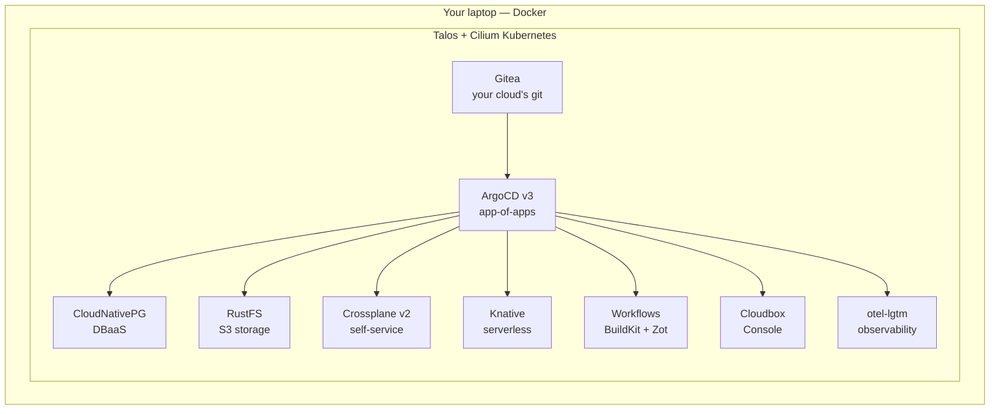

# So what *is* a cloud, anyway?

<!--
This section runs while the last laptops are still pulling images — it needs zero keyboard, just attention. Its job: turn "the cloud" from a place you rent into a list of things you can build. Every module later is one row of the table you're about to show. ~8 minutes, unhurried.

If cloudbox-init is still downloading for some people, say so now: "This next bit is exactly why we front-loaded the download — watch the screen, your laptop keeps working in the background."
-->

---
layout: fact
---

# There is no cloud.

It's just **someone else's computer.**

Today we make it <strong>yours.</strong>

<!--
The sticker everyone's seen — say it with the shrug it deserves, then take the other half seriously.

The joke is true, and that's the good news. "The cloud" is not exotic hardware; it's ordinary computers plus software that turns them into rentable primitives. The hyperscaler's moat was never the metal — you have metal, it's under your fingers right now. The moat is the software on top: the APIs, the automation, the self-service. And that software — all of it — is open source.

So the meme is our thesis, inverted: if a cloud is just someone else's computer, then your computer, plus the right open-source control plane, is a cloud. That's the whole workshop in one line.
-->

---

# What makes a computer a *cloud*

Three things — none of them the hardware:

- **Primitives** — compute, storage, databases, delivered as APIs
- **A control plane** — software that provisions and heals them
- **Self-service** — you *ask*, and it appears; nobody files a ticket

The magic was always the control plane, never the metal.

<!--
Walk the three, slowly — this is the mental model the whole day hangs on:

1. Primitives: a cloud sells you building blocks — a database, a bucket, a function — each behind an API, not a rack you wire up. You compose primitives; you don't assemble servers.
2. Control plane: behind every "managed" service is a control loop that provisions, monitors, fails over, backs up. That software is the product. When you pay for RDS, you're paying for that loop, not for Postgres.
3. Self-service: the thing that made cloud feel like magic in 2008 wasn't virtualization — it was that a developer could *ask* for a database and get one in minutes, with no human in the loop.

Now the punchline that sets up the table: Kubernetes is a control plane. Operators are the control loops. Git is the self-service front door. Every ingredient is open source — so a cloud is a thing you can just... run. Here's the shopping list.
-->

---

# The core primitives are all open source

| Cloud primitive | What you'd rent | What you'll **run today** |
|---|---|---|
| Kubernetes / compute | EKS · AKS · GKE | **Talos + Cilium** |
| GitOps delivery | *the mechanic itself* | **Gitea + ArgoCD** |
| Managed Postgres | RDS · Cloud SQL · Azure DB | **CloudNativePG** |
| Object storage (S3) | S3 · GCS · Blob | **RustFS** |
| Self-service infra | Service Catalog · CloudFormation | **Crossplane** |
| Observability | CloudWatch · Cloud Ops | **Grafana + OpenTelemetry** |

Modules 01–05 — the core. One row each.

<!--
Don't read the table aloud row by row — let them scan it, then make three points:

- The left column is what a hyperscaler charges for. The right column is what runs on your laptop by lunch. Same primitive, both times — the operator on the right IS the managed service on the left, minus the bill and the account.
- GitOps has no clean hyperscaler product to name because it isn't a product — it's the delivery *mechanic*. Everything below ArgoCD arrives as a git commit. That's the one move you'll repeat in every module.
- Nothing here is a toy pick: Cilium, CloudNativePG, Crossplane, OpenTelemetry are all CNCF projects running in real production somewhere right now.

Point at the module map on the wall/handout: "Modules 01 through 05 are literally these six rows, top to bottom."
-->

---

# ...and so is everything above it

| Cloud primitive | What you'd rent | What you'll **run today** |
|---|---|---|
| Serverless | Lambda · Cloud Run · Functions | **Knative** |
| CI / image builds | CodeBuild · Cloud Build | **Argo Workflows + BuildKit** |
| Container registry | ECR · Artifact Registry · ACR | **Zot** |
| Cloud console | AWS/Azure/GCP Console | **Cloudbox Console** |

Modules 06–09 — the stretch. Same idea, all the way up the stack.

<!--
The stretch tier, framed as "the cloud doesn't stop at databases":

- Serverless: scale-to-zero request-driven containers. Knative is the open engine underneath a lot of what you'd recognize — it's literally what Google Cloud Run is built on.
- CI + registry: the build-and-ship half of a cloud. You'll build a container INSIDE your cluster with Argo Workflows + BuildKit and push it to your own Zot registry — no Docker Hub, no cloud build minutes.
- Console: even the web console is just software reading an API. The Cloudbox Console is ~100 lines of Go over the Kubernetes API — and you'll read its source in module 08.

Say the tiering honestly: "Core is 00–05 and it's a complete cloud on its own. Everything on this second table is for the fast 20% and for your couch tonight — it's all public and nothing later depends on it."
-->

---

# Your cloud, in a box

The table, wired together — you'll see this again at the end, all green.

<!--
The map of the whole day — the comparison table you just showed, now as one running system. You'll return to this exact diagram in the closing, when every box is up and green across the room. Walk it bottom-up, one layer per beat:

1. Docker on your laptop is the "datacenter".
2. Talos Linux v1.13 nodes run as containers — an immutable, API-only OS purpose-built for Kubernetes (module 01). Cilium does networking in eBPF; there is no kube-proxy in this cluster at all.
3. Gitea + ArgoCD are the heart (module 02): the git server lives IN the cluster, and ArgoCD delivers everything below it from that git repo. Nothing depends on GitHub or the venue WiFi.
4. The platform services: CloudNativePG for managed Postgres, RustFS for S3-compatible object storage (module 03), Crossplane v2 for the self-service API (module 04).
5. The stretch tier: Knative serverless (06), in-cluster CI with BuildKit and the Zot registry (07), the Cloudbox Console portal (08), and observability with grafana/otel-lgtm woven throughout.

Key sentence to land before moving on: "Everything below ArgoCD arrives as a git commit. That's the mechanic you'll use all day."

Don't explain any component deeply here — each gets its own module framing. Now hand over to the mechanics: how today actually works.
-->
