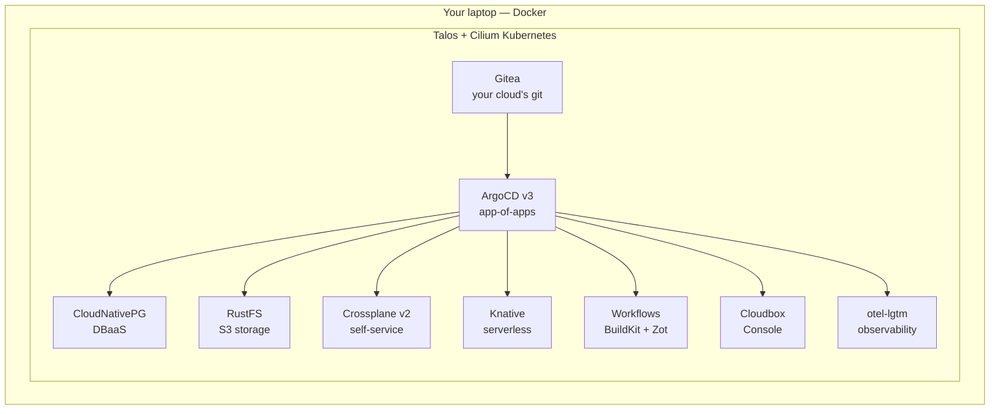

# What if you can no longer trust your cloud?

<!--
The hook. Don't rush this — it's the emotional core of the day, but it's also only three slides.

Frame it as a 2026 question, not a hypothetical: European organizations are actively re-evaluating their cloud dependencies. Ask for a show of hands: "Who has had a cloud bill surprise? Who has had a compliance discussion about where data physically lives? Who has watched a product they depend on change license or get discontinued?"

Every hand that goes up is a person who already knows why they're here.
-->

---

# Three ways a cloud stops being yours

- **Price** — the bill is a decision you don't make
- **Jurisdiction** — your data, someone else's law
- **Roadmap** — products get discontinued under you

None of these are hypothetical. All three happened to real teams recently.

<!--
Walk each bullet with one concrete beat:

- Price: egress fees, license changes rippling into managed-service pricing, the "we renegotiated your enterprise agreement" email. You don't control it; you absorb it.
- Jurisdiction: for a Norwegian public-sector audience this lands hard — CLOUD Act, Schrems II fallout, data residency requirements. Hans can speak from government experience here.
- Roadmap: the software you depend on can be discontinued or taken proprietary. We'll meet a very concrete example of this in module 03 (the MinIO story) — tease it, don't spoil it.

Transition: "The usual answer is 'that's the price of the cloud'. Today we test a different answer: what if the cloud primitives themselves — managed databases, object storage, self-service APIs — are things you can just... run?"
-->

---
layout: fact
---

# You leave with a cloud on **your** laptop

Still running tomorrow. No account. No bill. No permission.

<!--
The promise slide. One sentence, said slowly:

"At the end of these four hours, your laptop is running a complete cloud platform — Kubernetes, GitOps, databases-as-a-service, S3-compatible storage, a self-service API, a portal — and when you close the lid and go home, it's still yours. No trial account, no free tier, no vendor."

Then the meta-point from our design principles: that running artifact, plus the mental model of how it fits together, is the one thing a YouTube video or an AI assistant cannot give you. That's why this is a workshop and not a talk.

Everything is open source and everything is pinned — the repo will still build this platform in a year.
-->

---

# Cloud in a box

<!--
The map of the whole day — you'll see this diagram again at the end, when everything on it is running and green. Walk it bottom-up, one layer per beat:

1. Docker on your laptop is the "datacenter".
2. Talos Linux v1.13 nodes run as containers — an immutable, API-only OS purpose-built for Kubernetes (module 01). Cilium does networking in eBPF; there is no kube-proxy in this cluster at all.
3. Gitea + ArgoCD are the heart (module 02): the git server lives IN the cluster, and ArgoCD delivers everything below it from that git repo. Nothing depends on GitHub or the venue WiFi.
4. The platform services: CloudNativePG for managed Postgres, RustFS for S3-compatible object storage (module 03), Crossplane v2 for the self-service API (module 04).
5. The stretch tier: Knative serverless (06), in-cluster CI with BuildKit and the Zot registry (07), the Cloudbox Console portal (08), and observability with grafana/otel-lgtm woven throughout.

Key sentence: "Everything below ArgoCD arrives as a git commit. That's the mechanic you'll use all day."

Don't explain any component deeply here — each gets its own module framing.
-->
