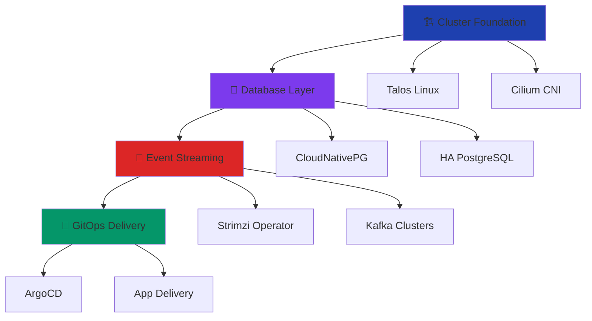

# Workshop Structure

## Labs Overview

1. **🏗️ Foundation** (45 min)
   - Talos Linux cluster
   - Cilium networking
   - Basic connectivity

2. **🐘 Database Platform** (60 min)
   - CloudNativePG operator
   - PostgreSQL clusters
   - Backup & recovery

3. **📨 Event Streaming** (45 min)
   - Strimzi Kafka operator
   - Topic management
   - Producer/consumer apps

4. **🚀 GitOps Platform** (60 min)
   - ArgoCD setup
   - Application deployment
   - Multi-environment workflow

## Learning Path

<!--
This workshop follows a progressive building approach:
1. Start with solid foundation (Kubernetes + networking)
2. Add data layer capabilities
3. Enable event-driven architecture
4. Automate deployment processes

Each lab builds on the previous one, creating a complete platform by the end.
Total time: 4 hours with breaks
Format: Demo + hands-on + discussion
-->

---

# What You'll Learn

<v-clicks>

**🎯 Platform Engineering Principles**
- Self-service infrastructure
- Golden path abstractions
- Developer experience design

**⚙️ CNCF Tool Mastery**
- Operator patterns and lifecycle
- GitOps workflows
- Infrastructure as Code

**🏗️ Production Architecture**
- High availability patterns
- Monitoring and observability
- Security and compliance

**🚀 Real-World Skills**
- Hands-on with production tools
- Troubleshooting techniques
- Best practices and anti-patterns

</v-clicks>

<!--
By the end of this workshop, you'll have:
- A complete working platform
- Deep understanding of each component
- Confidence to implement in your organization
- Network of fellow platform engineers

We focus on practical skills you can use immediately.
-->

---

# Workshop Format

  
👨‍🏫

  
Demo

  

    Live coding and explanation
  

  
🔨

  
Hands-On

  

    Build it yourself
  

  
💬

  
Discussion

  

    Q&A and troubleshooting
  

<v-click>

### Getting Help 🆘

- **Raise your hand** - We're here to help!
- **Ask questions** - No question is too basic
- **Share experiences** - Learn from each other
- **Take breaks** - This is intensive content

</v-click>

<!--
Workshop rhythm:
- 15-20 min demo/explanation per major concept
- 20-30 min hands-on implementation
- 5-10 min discussion and Q&A
- Short breaks between labs

We encourage questions throughout - don't wait until the end!
-->