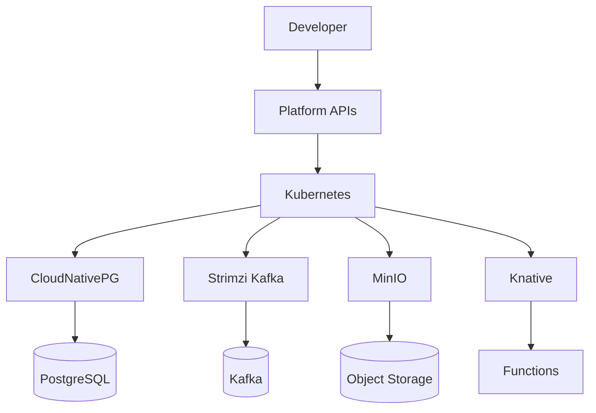

# Cloud on Your Terms
## Building Your Own Cloud-Native Platform

**JavaZone 2025 Workshop**

<div class="pt-12">
  <span @click="$slidev.nav.next" class="px-2 py-1 rounded cursor-pointer bg-blue-600 text-white hover:bg-blue-700">
    Start Building! <carbon:arrow-right class="inline"/>
  </span>
</div>

<div class="abs-br m-6 flex gap-2">
  <div class="text-sm opacity-50">
    Øyvind Randa • Hans Kristian Flaatten
  </div>
</div>

---
layout: intro
---

# Welcome Platform Engineers! 👋

<div class="leading-8 opacity-80">
In the next 4 hours, we'll build a complete cloud-native platform from scratch.<br>
No vendor lock-in. No surprises. Just pure CNCF power.
</div>

<div class="my-10 grid grid-cols-3 gap-4 text-center">
  <div>
    <div class="text-2xl">🏗️</div>
    <div class="text-sm">Platform Engineering</div>
  </div>
  <div>
    <div class="text-2xl">🐘</div>
    <div class="text-sm">Database-as-a-Service</div>
  </div>
  <div>
    <div class="text-2xl">📨</div>
    <div class="text-sm">Event Streaming</div>
  </div>
</div>

<div v-click class="abs-br m-6 p-4 bg-blue-50 text-gray-800 rounded">
  <div class="text-sm font-bold">Prerequisites ✅</div>
  <div class="text-xs opacity-80">Modern laptop • Docker • Enthusiasm</div>
</div>

<!--
Welcome everyone to the workshop! Set expectations:
- 4 hours intensive hands-on
- Build real platform components
- No PowerPoint theory - we code

Check if everyone has prerequisites ready:
- Docker running
- kubectl available
- Terminal access
-->

---

# The Challenge We're Solving

<v-clicks>

- **Vendor Lock-in** - What if your cloud provider changes terms?
- **Multi-Cloud Reality** - Different interfaces, different APIs
- **Developer Experience** - Complex infrastructure shouldn't slow down development
- **Control & Compliance** - Your data, your rules, your infrastructure

</v-clicks>

<div v-click="5" class="mt-8 p-4 bg-orange-50 text-gray-800 rounded-lg border-l-4 border-orange-400">
  <div class="font-bold text-gray-800">💡 Solution</div>
  <div class="text-sm opacity-80 text-gray-700">
    Build your own cloud-native platform using battle-tested CNCF tools
  </div>
</div>

---
layout: two-cols
---

# Our Technology Stack

<v-clicks>

**Foundation**
- 🏗️ **Kubernetes (Talos)** - Immutable OS, API-driven
- 🌐 **Cilium** - eBPF networking & security

**Data Platform**
- 🐘 **CloudNativePG** - PostgreSQL operator
- 📨 **Strimzi Kafka** - Event streaming
- 💾 **MinIO** - Object storage

**Platform Services**
- 🚀 **ArgoCD** - GitOps delivery
- ⚡ **Knative** - Serverless functions
- 🔧 **Tekton** - CI/CD pipelines

</v-clicks>

::right::

<div v-click="8" class="mt-4">



</div>

---

# Workshop Structure

<div class="grid grid-cols-2 gap-8">

<div>

## Labs Overview

<v-clicks>

**Lab 1: Foundation** (30 min)
- Talos Kubernetes setup
- Immutable infrastructure concepts

**Lab 2: Database Platform** (45 min)
- CloudNativePG installation
- PostgreSQL clusters & HA
- Database-as-a-Service

**Lab 3: Event Streaming** (45 min)
- Strimzi Kafka operator
- Event-driven architectures

**Lab 4: GitOps & Automation** (45 min)
- ArgoCD deployment
- Infrastructure as Code

</v-clicks>

</div>

<div>

## Learning Approach

<v-clicks>

🧑‍💻 **Hands-on First**
- Learn by building, not just reading

🔍 **Under the Hood**
- See what automation scripts actually do

🏗️ **Progressive Complexity**
- Start simple, add enterprise features

🚨 **Real Scenarios**
- Failure testing, monitoring, scaling

📚 **Production Ready**
- Patterns you can use at work

</v-clicks>

</div>

</div>

---
layout: center
class: text-center
---

# Lab 1: Foundation
## Setting up Talos Kubernetes

<div class="mt-8">
  <span @click="$slidev.nav.next" class="px-4 py-2 rounded cursor-pointer bg-blue-600 text-white hover:bg-blue-700">
    Let's Build! <carbon:arrow-right class="inline"/>
  </span>
</div>

---

# Why Talos Linux?

<div class="grid grid-cols-2 gap-8">

<div>

## Traditional Kubernetes
```bash
# SSH into nodes
ssh user@node1

# Install Docker/containerd
apt-get install docker.io

# Configure kubelet
systemctl enable kubelet

# Security concerns
# - SSH access
# - Package managers
# - Multiple ways to break things
```

</div>

<div>

## Talos Linux
```bash
# API-driven management
talosctl cluster create

# Immutable OS
# - No SSH/shell access
# - No package manager
# - API-only configuration
# - Predictable behavior

# Fast boot (~45 seconds)
# Kubernetes-specific OS
```

</div>

</div>

<div v-click class="mt-4 p-4 bg-green-50 text-gray-800 rounded">
  **Result**: More secure, more predictable, easier to manage at scale
</div>

---

# Lab 1 Demo: Cluster Creation

Let's see Talos in action:

````md magic-move {lines: true}
```bash
# Generate machine configuration
talosctl gen config platform-cluster https://localhost:6443
```

```bash
# Create config patch for Cilium
cat > cilium-patch.yml << 'EOF'
cluster:
  network:
    cni:
      name: none  # Disable default CNI
  proxy:
    disabled: true  # Disable kube-proxy
EOF
```

```bash
# Create multi-node cluster
talosctl cluster create \
  --name platform-cluster \
  --controlplanes 3 \
  --workers 2 \
  --config-patch @cilium-patch.yml
```

```bash
# Verify cluster
kubectl get nodes
# NAME           STATUS   ROLES           AGE
# node-1         Ready    control-plane   2m
# node-2         Ready    control-plane   2m
# node-3         Ready    control-plane   2m
# node-4         Ready    <none>          1m
# node-5         Ready    <none>          1m
```
````

---
layout: center
class: text-center
---

# Lab 2: Database Platform
## CloudNativePG in Action

<div class="mt-8">
  <span @click="$slidev.nav.next" class="px-4 py-2 rounded cursor-pointer bg-purple-600 text-white hover:bg-purple-700">
    Build Data Platform! <carbon:data-base class="inline"/>
  </span>
</div>

---

# Why CloudNativePG?

<v-clicks>

**Traditional Database Setup**
- Manual installation and configuration
- Custom backup scripts
- Manual failover procedures
- Snowflake servers

**CloudNativePG Operator**
- Kubernetes-native PostgreSQL
- Automatic backup and recovery
- Built-in high availability
- Declarative configuration
- Production-grade monitoring

</v-clicks>

<div v-click="6" class="mt-6 grid grid-cols-3 gap-4 text-center">
  <div class="p-4 bg-blue-50 text-gray-800 rounded">
    <div class="text-xl">⚡</div>
    <div class="text-sm text-gray-700">Auto Failover</div>
  </div>
  <div class="p-4 bg-green-50 text-gray-800 rounded">
    <div class="text-xl">📊</div>
    <div class="text-sm text-gray-700">Built-in Monitoring</div>
  </div>
  <div class="p-4 bg-purple-50 text-gray-800 rounded">
    <div class="text-xl">🔄</div>
    <div class="text-sm text-gray-700">Point-in-Time Recovery</div>
  </div>
</div>

---

# Lab 2 Demo: PostgreSQL Cluster

Let's create a production-ready database:

````md magic-move {lines: true}
```bash
# Install the operator
helm upgrade --install cnpg \
  --namespace cnpg-system \
  --create-namespace \
  cnpg/cloudnative-pg
```

```yaml
# PostgreSQL Cluster Definition
apiVersion: postgresql.cnpg.io/v1
kind: Cluster
metadata:
  name: workshop-db
spec:
  instances: 3  # High availability

  postgresql:
    parameters:
      max_connections: "200"
      shared_buffers: "256MB"
```

```yaml
# Complete cluster with monitoring
apiVersion: postgresql.cnpg.io/v1
kind: Cluster
metadata:
  name: workshop-db
spec:
  instances: 3

  # Performance tuning
  postgresql:
    parameters:
      max_connections: "200"
      shared_buffers: "256MB"
      effective_cache_size: "1GB"

  # Storage & resources
  storage:
    size: 1Gi
  resources:
    requests:
      memory: "256Mi"
      cpu: "100m"

  # Enable monitoring
  monitoring:
    enabled: true
```

```bash
# Test high availability
kubectl delete pod workshop-db-1

# Watch automatic failover
kubectl get pods -w
# workshop-db-1   0/1   Terminating   0     5m
# workshop-db-1   0/1   Pending       0     0s
# workshop-db-2   1/1   Running       0     5m  <- New primary!
```
````

---

# Database Operations Demo

<div class="grid grid-cols-2 gap-8">

<div>

**Connection & Testing**

```bash
# Get database password
DB_PASSWORD=$(kubectl get secret \
  workshop-db-app-user \
  -o jsonpath='{.data.password}' | base64 -d)

# Port forward
kubectl port-forward \
  svc/workshop-db-rw 5432:5432

# Connect with psql
PGPASSWORD=$DB_PASSWORD \
  psql -h localhost -p 5432 -U app -d appdb
```

</div>

<div>

**SQL Operations**

```sql
-- Create application table
CREATE TABLE users (
    id SERIAL PRIMARY KEY,
    name VARCHAR(100) NOT NULL,
    email VARCHAR(100) UNIQUE,
    created_at TIMESTAMP DEFAULT CURRENT_TIMESTAMP
);

-- Insert test data
INSERT INTO users (name, email) VALUES
    ('Alice Johnson', 'alice@example.com'),
    ('Bob Smith', 'bob@example.com');

-- Query data
SELECT * FROM users;
```

</div>

</div>

<div v-click class="mt-4 p-4 bg-blue-50 text-gray-800 rounded">
  **Result**: Production-ready PostgreSQL with zero manual database administration
</div>

---
layout: center
class: text-center
---

# What We've Built So Far

<div class="grid grid-cols-2 gap-8 mt-8">

<div class="p-6 bg-green-50 text-gray-800 rounded-lg">
  <div class="text-2xl mb-2">🏗️</div>
  <div class="font-bold text-gray-800">Kubernetes Foundation</div>
  <div class="text-sm opacity-80 text-gray-700">Talos Linux, Cilium networking</div>
</div>

<div class="p-6 bg-purple-50 text-gray-800 rounded-lg">
  <div class="text-2xl mb-2">🐘</div>
  <div class="font-bold text-gray-800">Database Platform</div>
  <div class="text-sm opacity-80 text-gray-700">PostgreSQL with automatic HA</div>
</div>

</div>

<div class="mt-8">
  <span @click="$slidev.nav.next" class="px-4 py-2 rounded cursor-pointer bg-orange-600 text-white hover:bg-orange-700">
    Continue to Event Streaming! <carbon:arrow-right class="inline"/>
  </span>
</div>

---
layout: end
class: text-center
---

# Ready to Build Your Platform?

<div class="grid grid-cols-3 gap-8 mt-8">

<div>
  <div class="text-2xl mb-2">📚</div>
  <div class="font-bold">Labs Repository</div>
  <div class="text-sm opacity-80">github.com/randax/jz-2025-platform-engineering</div>
</div>

<div>
  <div class="text-2xl mb-2">🎯</div>
  <div class="font-bold">Live Support</div>
  <div class="text-sm opacity-80">Raise your hand anytime!</div>
</div>

<div>
  <div class="text-2xl mb-2">🚀</div>
  <div class="font-bold">Next Steps</div>
  <div class="text-sm opacity-80">Take this knowledge to production</div>
</div>

</div>

<div class="mt-12">
  <div class="text-lg font-bold">Let's build something amazing together! 🎉</div>
</div>

---
